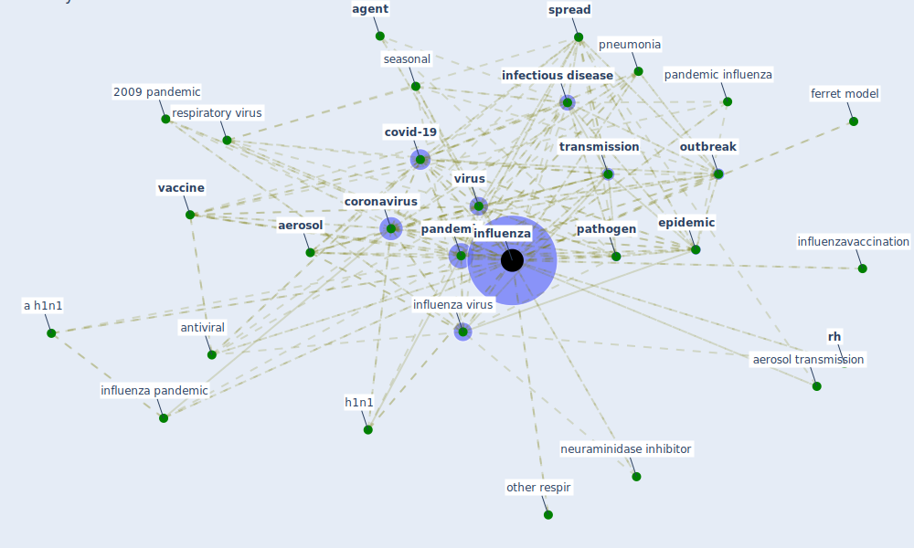

# Keyword: influenza

* [respiratory-infection](cluster_3)

## Keywords

 * 1918 pandemic, 2009 pandemic, a h1n1, a h1n1 bmc me, a h5n1, acute respiratory infection, [aerosol](keyword_aerosol), aerosol transmission, [agent](keyword_agent), agent base modelling, [airborne](keyword_airborne), airborne infectious organism, airborne virus, [antiviral](keyword_antiviral), asthma, avian influenza virus, b virus, [china](keyword_china), cold, cold season, [corona](keyword_corona), [coronavirus](keyword_coronavirus), cough, covid 19 outbreak, [covid 19 pandemic](keyword_covid_19_pandemic), [covid-19](keyword_covid-19), crowd effect, crowd gathering, curcumin, [disease](keyword_disease), [droplet](keyword_droplet), egypt, emerge disease, emergence, [epidemic](keyword_epidemic), ferret model, fluenza, h1n1, h1n1 2009 pandemic in singapore, h1n1 23, h1n1 influenza, h1n1 virus, h5 ha h1n1 virus, h5n1, [healthcare associate infection](keyword_healthcare_associate_infection), hidtil ukendt, host, [infection](keyword_infection), [infection control](keyword_infection_control), infectious, infectious aerosol, infectious agent, [infectious disease](keyword_infectious_disease), infectious virus, [influenza](keyword_influenza), influenza latent period, influenza pandemic, influenza s seasonality, influenza transmission, [influenza virus](keyword_influenza_virus), influenzavaccination, innate resistance, its health risk, lancet infect, [mask](keyword_mask), neuraminidase inhibitor, ningsintervention, other respir, other respir viruses, [outbreak](keyword_outbreak), [pandemic](keyword_pandemic), pandemic influenza, [pathogen](keyword_pathogen), pneumonia, poliomyelitis, poliomylitis, respir viruses, respiratory illness, respiratory infection, respiratory infectious disease, respiratory pathogen, respiratory virus, rh, rna lipid envelop respiratory virus, [sar cov 2](keyword_sar_cov_2), seasonal, seasonality, [spread](keyword_spread), swine origin influenza virus, [symptom](keyword_symptom), [temperature](keyword_temperature), temperature humidity and influenza incidence, [transmission](keyword_transmission), transmission efficiency, type a, [vaccine](keyword_vaccine), [ventilation](keyword_ventilation), [virus](keyword_virus), virus infection, wave of disease

## Mapping

## Neighbours

### Closest articles

* Mechanistic insights into the effect of humidity on airborne influenza virus survival, transmission and incidence - [LINK](article_marr_mechanistic_2019)
* Physical interventions to interrupt or reduce the spread of respiratory viruses: systematic review - [LINK](article_jefferson_physical_2008)
* Understanding the role of urban design in disease spreading - [LINK](article_brizuela_understanding_2019)
* Respiratory pandemics, urban planning and design: A multidisciplinary rapid review of the literature - [LINK](article_harris_respiratory_2022)
* ASHRAE Position Document on Infectious Aerosols - [LINK](article_ashrae_ashrae_2022)
* Effects of temperature and humidity on the spread of COVID-19: A systematic review - [LINK](article_mecenas_effects_2020)
* A Comprehensive Review of the COVID-19 Pandemic and the Role of IoT, Drones, AI, Blockchain, and 5G in Managing its Impact - [LINK](article_chamola_comprehensive_2020)
* Coronavirus disease 2019: The harms of exaggerated information and non‐evidence‐based measures - [LINK](article_ioannidis_coronavirus_2020)
* Environmental factors involved in SARS-CoV-2 transmission: effect and role of indoor environmental quality in the strategy for COVID-19 infection control - [LINK](article_azuma_environmental_2020)
* A review of facilities management interventions to mitigate respiratory infections in existing buildings - [LINK](article_zhang_review_2022)

### Closest BPs

