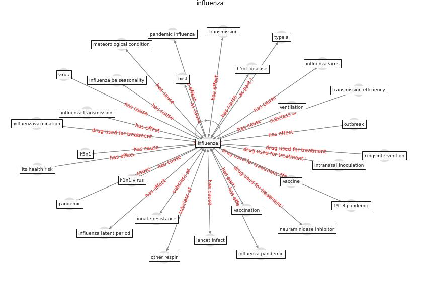

# Keyword: __influenza__
## Clusters

* Cluster 3: [city-spatial](cluster_3)

## Concepts

 

## Top 10 articles for __influenza__
* Mechanistic insights into the effect of humidity on
airborne influenza virus survival, transmission and
incidence ([marr_mechanistic_2019](article_marr_mechanistic_2019))
* Physical interventions to interrupt or reduce the spread
of respiratory viruses: systematic review ([jefferson_physical_2008](article_jefferson_physical_2008))
* Understanding the role of urban design in disease
spreading ([brizuela_understanding_2019](article_brizuela_understanding_2019))
* RUDDS_bioRxiv_update ([RUDDS_bioRxiv_update](article_RUDDS_bioRxiv_update))
* ashrae_ashrae_2022 ([ashrae_ashrae_2022](article_ashrae_ashrae_2022))
* Respiratory pandemics, urban planning and design: A
multidisciplinary rapid review of the literature ([harris_respiratory_2022](article_harris_respiratory_2022))
* Methods for air cleaning and protection of building
occupants from airborne pathogens ([bolashikov_methods_2009](article_bolashikov_methods_2009))
* Effects of temperature and humidity on the spread of
COVID-19: A systematic review ([mecenas_effects_2020](article_mecenas_effects_2020))
* A Comprehensive Review of the COVID-19 Pandemic
and the Role of IoT, Drones, AI, Blockchain, and
5G in Managing its Impact ([chamola_comprehensive_2020](article_chamola_comprehensive_2020))
* How can airborne transmission of COVID-19 indoors be
minimised? ([morawska_how_2020](article_morawska_how_2020))
