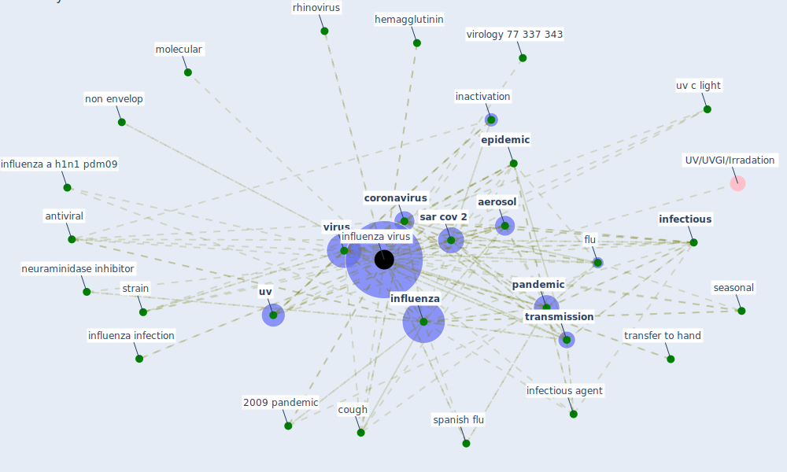

# Keyword: influenza virus

## Keywords

 * 2009 pandemic, a puerto rico 8 34, [aerosol](keyword_aerosol), aerosolize, [antiviral](keyword_antiviral), [coronavirus](keyword_coronavirus), cough, [epidemic](keyword_epidemic), [fever](keyword_fever), flu, h5n1, hemagglutinin, host, inactivation, [infectious](keyword_infectious), infectious agent, [influenza](keyword_influenza), influenza a h1n1 pdm09, influenza infection, [influenza virus](keyword_influenza_virus), influenza viruses, live virus vaccine attenuation, molecular, neuraminidase inhibitor, non envelop, noroviru, [pandemic](keyword_pandemic), [pathogen](keyword_pathogen), respiratory droplet, respiratory system, [rh](keyword_rh), rhinovirus, [sar cov 2](keyword_sar_cov_2), seasonal, spanish flu, strain, transfer to hand, [transmission](keyword_transmission), [uv](keyword_uv), uv c light, virology 77 337 343, [virus](keyword_virus)

## Mapping

## Neighbours

### Closest articles

* Mechanistic insights into the effect of humidity on airborne influenza virus survival, transmission and incidence - [LINK](article_marr_mechanistic_2019)
* Environmental factors involved in SARS-CoV-2 transmission: effect and role of indoor environmental quality in the strategy for COVID-19 infection control - [LINK](article_azuma_environmental_2020)
* Current knowledge of COVID-19: Advances, challenges and future perspectives - [LINK](article_wu_current_2021)
* ASHRAE Position Document on Infectious Aerosols - [LINK](article_ashrae_ashrae_2022)
* COVID-19 Could Leverage a Sustainable Built Environment - [LINK](article_pinheiro_covid-19_2020)
* A Comprehensive Review of the COVID-19 Pandemic and the Role of IoT, Drones, AI, Blockchain, and 5G in Managing its Impact - [LINK](article_chamola_comprehensive_2020)
* Applications of ultraviolet germicidal irradiation disinfection in health care facilities: Effective adjunct, but not stand-alone technology - [LINK](article_memarzadeh_applications_2010)
* How the 5G Enabled the COVID-19 Pandemic Prevention and Control: Materiality, Affordance, and (De-)Spatialization - [LINK](article_li_how_2022)
* Design COVID-19 Ontology: A Healthcare and Safety Perspective - [LINK](article_aloulou_design_2022)
* Respiratory pandemics, urban planning and design: A multidisciplinary rapid review of the literature - [LINK](article_harris_respiratory_2022)

### Closest BPs

