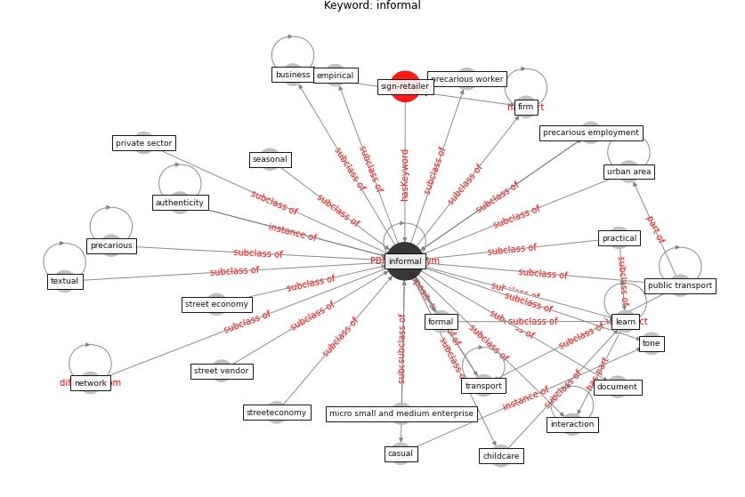

# Keyword: informal

* [sign-retailer](cluster_Cluster_8)

## Keywords

 * Cluster_8, authenticity, [business](keyword_business), casual, childcare, document, empirical, firm, formal, [informal](keyword_informal), [interaction](keyword_interaction), learn, micro small and medium enterprise, network, practical, precarious, precarious employment, precarious worker, private sector, [public transport](keyword_public_transport), seasonal, street economy, street vendor, streeteconomy, textual, tone, [transport](keyword_transport), urban area

## Concepts

 

## Neighbours

### Closest articles

* Urban planning after COVID-19 - [LINK](article_rtpi_urban_2021)
* How COVID-19 Could Accelerate the Adoption of New Retail Technologies and Enhance the (E-)Servicescape - [LINK](article_willems_how_2021)
* Sustainable work throughout the life course: National policies and strategies, Publications Office of the European Union - [LINK](article_eurofund_sustainable_2016)
* World Bank Development Report - [LINK](article_world_bank_world_2022)
* An Overview of Biomedical Ontologies for Pandemics and Infectious Diseases Representation - [LINK](article_bayoudhi_overview_2021)
* The Impact of COVID-19 on Public Space: A Review of the Emerging Questions - [LINK](article_honey-roses_impact_2020)
* Case Study on Finnish TVETA Resilient Model of Training During COVID-19 - [LINK](article_unesco_case_2021)
* The COVID-19 pandemic: Lessons on building more equal and sustainable societies - [LINK](article_van_barneveld_covid-19_2020)
* Assessment of COVID-19 precautionary measures in sports facilities: A case study on a health club in Saudi Arabia - [LINK](article_ibrahim_assessment_2022)

### Closest BPs

