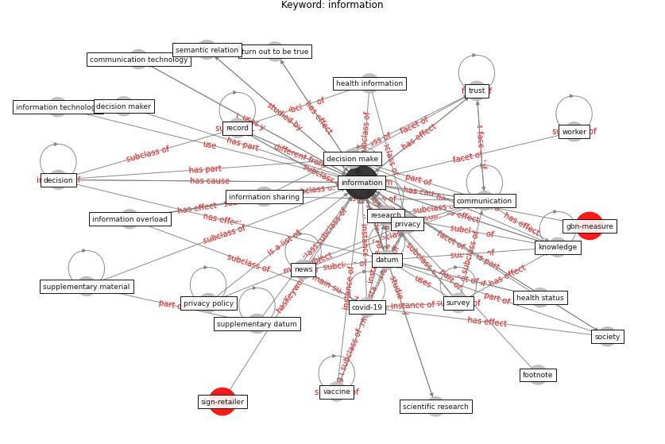

# Keyword: information

* [gbn-measure](cluster_Cluster_10)

## Keywords

 * 95 ci, augmented reality, collect, communication, communication channel, communication technology, [covid-19](keyword_covid-19), database, [datum](keyword_datum), datum analytic, datum availability, datum collection, datum flow, datum report, [datum sharing](keyword_datum_sharing), decision, decision make, decision maker, dialogue, digital communication, distance learning, documentation, documentation of information, domain knowledge, [education](keyword_education), evidence base, [font](keyword_font), footnote, health information, health status, imagemanagement, [information](keyword_information), information overload, information sharing, information technology, [knowledge](keyword_knowledge), learn, liquid gold, medication, [misinformation](keyword_misinformation), more information, [need](keyword_need), [news](keyword_news), news article, [noise](keyword_noise), [patient](keyword_patient), perception, personal datum, pixel, preventative measure, [privacy](keyword_privacy), [privacy policy](keyword_privacy_policy), probability measure, prompt, [public](keyword_public), publication, publicly available, purchase decision, real time, real time datum, record, report, [research](keyword_research), research community, [resilience](keyword_resilience), scientific research, secure information sharing, self report, semantic relation, shopper, [sign](keyword_sign), [social distancing](keyword_social_distancing), [social medium](keyword_social_medium), [society](keyword_society), statistic, statistical analysis, supplemental datum, supplementary datum, supplementary information, supplementary material, survey, symptom tracking, systematic review, [technology](keyword_technology), telecommunication, telecommunication technology, toinformatic, [training](keyword_training), transmit, trust, truth, turn out to be true, unstructured datum, [vaccine](keyword_vaccine), verifiable, verifiable source, webinar, word document, [worker](keyword_worker), worker feel about the office

## Concepts

 

## Neighbours

### Closest articles

* What drives unverified information sharing and cyberchondria during the COVID-19 pandemic? - [LINK](article_laato_what_2020)
* Propositions for a Resilient, Post-COVID-19 Future for the AEC Industry - [LINK](article_nassereddine_propositions_2021)
* Guidelines for resilience systems analysis - [LINK](article_oecd_guidelines_2014)
* Health, Wellbeing \& Productivity in Offices - [LINK](article_world_green_building_council_health_2014)
* Pandemic Analytics: How Countries are Leveraging Big Data Analytics and Artificial Intelligence to Fight COVID-19? - [LINK](article_mehta_pandemic_2021)
* How COVID-19 Could Accelerate the Adoption of New Retail Technologies and Enhance the (E-)Servicescape - [LINK](article_willems_how_2021)
* Contributions of Smart City Solutions and Technologies to Resilience against the COVID-19 Pandemic: A Literature Review - [LINK](article_sharifi_contributions_2021)
* Preparing critical infrastructure for the future: Lessons learnt from the Covid-19 pandemic - [LINK](article_tomalska_preparing_2022)
* On the Coronavirus (COVID-19) Outbreak and the Smart City Network: Universal Data Sharing Standards Coupled with Artificial Intelligence (AI) to Benefit Urban Health Monitoring and Management - [LINK](article_allam_coronavirus_2020)
* COVID-19 misinformation: Accuracy of articles about coronavirus prevention mostly shared on social media - [LINK](article_obiala_covid-19_2021)

### Closest BPs

