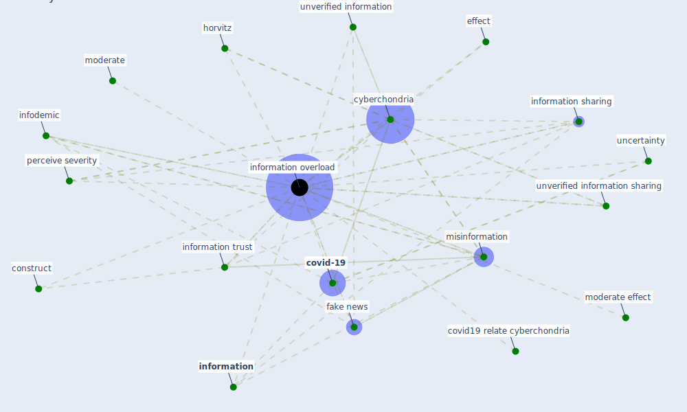

# Keyword: information overload

## Keywords

 * construct, [covid-19](keyword_covid-19), covid19 relate cyberchondria, [cyberchondria](keyword_cyberchondria), effect, [fake news](keyword_fake_news), horvitz, infodemic, [information](keyword_information), [information overload](keyword_information_overload), information sharing, information trust, [misinformation](keyword_misinformation), moderate, moderate effect, perceive severity, uncertainty, unverified information, unverified information sharing

## Mapping

## Neighbours

### Closest articles

* What drives unverified information sharing and cyberchondria during the COVID-19 pandemic? - [LINK](article_laato_what_2020)
* Psychological Effects of Home Confinement and Social Distancing Derived from COVID-19 in the General Population—A Systematic Review - [LINK](article_rodriguez-fernandez_psychological_2021)

### Closest BPs

