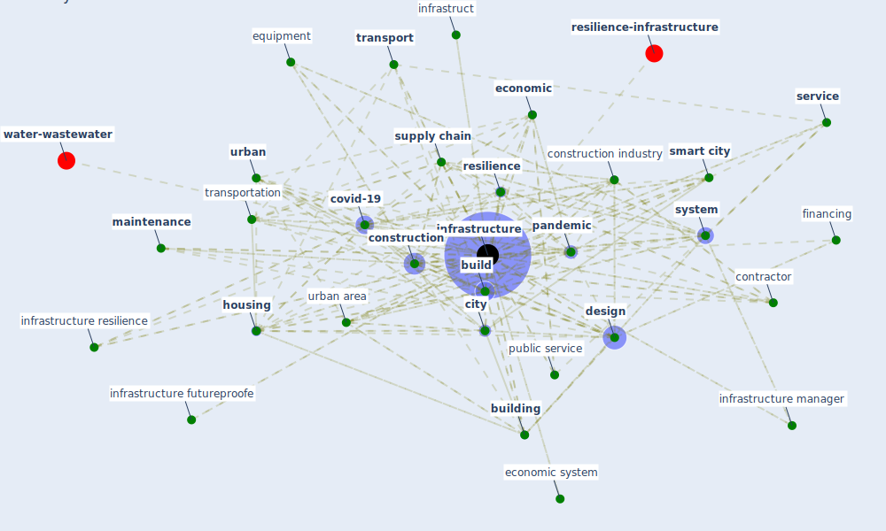

# Keyword: infrastructure

## Keywords

 * asset, bridge, [build](keyword_build), [build environment](keyword_build_environment), [building](keyword_building), [business](keyword_business), [city](keyword_city), city transportation, [community](keyword_community), [construction](keyword_construction), [construction industry](keyword_construction_industry), [contractor](keyword_contractor), [covid-19](keyword_covid-19), criticality, [design](keyword_design), development, [device](keyword_device), earthquake, [economic](keyword_economic), economic system, efficiency, [energy](keyword_energy), [engineer](keyword_engineer), [environment](keyword_environment), equipment, financing, future proofing, [green](keyword_green), hardware, hazard, health care informatic, [healthcare](keyword_healthcare), healthcare infrastructure, [house](keyword_house), [housing](keyword_housing), [industry](keyword_industry), information infrastructure, infrastruct, infrastructural, [infrastructure](keyword_infrastructure), infrastructure covid 19, infrastructure development, infrastructure futureproofe, infrastructure futureproofing, infrastructure investment, infrastructure manager, infrastructure resilience, infrastructure system, interconnect, [interdependency](keyword_interdependency), investment, land management, maintenance, [management](keyword_management), micro level factor, [network](keyword_network), [news](keyword_news), operation, operator, [pandemic](keyword_pandemic), park, pellicer, [physical](keyword_physical), [plan](keyword_plan), port, post covid recovery, [project](keyword_project), public infrastructure, public investment, public mass transit, public service, [public space](keyword_public_space), [resilience](keyword_resilience), resilient community, [service](keyword_service), service provision, [shock](keyword_shock), [smart city](keyword_smart_city), storage, strain, [supply chain](keyword_supply_chain), [sustainability](keyword_sustainability), [system](keyword_system), system hardware, [technology](keyword_technology), technoscience, [transport](keyword_transport), transport system, [transportation](keyword_transportation), underdeveloped world, [urban](keyword_urban), urban area, urban environment, urban space, urban transport, waste, water infrastructure, water system, wicked complex process, [wifi](keyword_wifi)

## Mapping

## Neighbours

### Closest articles

* COVID-19 and a new resilient infrastructure landscape - [LINK](article_oecd_covid-19_2021)
* Urban planning after COVID-19 - [LINK](article_rtpi_urban_2021)
* COVID-19 as a Harbinger of Transforming Infrastructure Resilience - [LINK](article_carvalhaes_covid-19_2020)
* A review of definitions and measures of system resilience - [LINK](article_hosseini_review_2016)
* Emergency Healthcare Facilities: Managing Design in a Post Covid-19 World - [LINK](article_marinelli_emergency_2020)
* Future (post-COVID) digital, smart and sustainable cities in the wake of 6G: Digital twins, immersive realities and new urban economies - [LINK](article_allam_future_2021)
* COVID-19 pandemic: the effects and prospects in the construction industry. - [LINK](article_ogunnusi_covid-19_2020)
* COVID-19 Pandemic: Rethinking Strategies for Resilient Urban Design, Perceptions, and Planning - [LINK](article_afrin_covid-19_2021)
* Guidelines for Responding to COVID-19 Pandemic: Best Practices, Impacts, and Future Research Directions - [LINK](article_assaad_guidelines_2021)
* Mechanisms for addressing the impact of COVID-19 on infrastructure projects - [LINK](article_king_mechanisms_2021)

### Closest BPs

