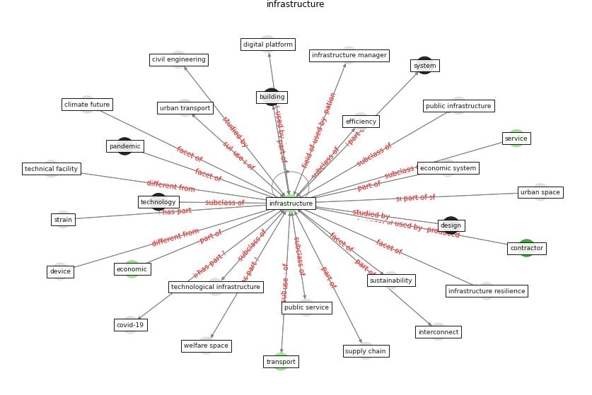

# Keyword: __infrastructure__
## Clusters

* Cluster 4: [resilience-health](cluster_4)

## Concepts

 

## Top 10 articles for __infrastructure__
* oecd_covid-19_2021 ([oecd_covid-19_2021](article_oecd_covid-19_2021))
* carvalhaes_covid-19_2020 ([carvalhaes_covid-19_2020](article_carvalhaes_covid-19_2020))
* rtpi_urban_2021 ([rtpi_urban_2021](article_rtpi_urban_2021))
* A review of definitions and measures of system
resilience ([hosseini_review_2016](article_hosseini_review_2016))
* Future (post-COVID) digital, smart and sustainable
cities in the wake of 6G: Digital twins, immersive
realities and new urban economies ([allam_future_2021](article_allam_future_2021))
* realdania_refleksioner_2022_EN ([realdania_refleksioner_2022_EN](article_realdania_refleksioner_2022_EN))
* afrin_covid-19_2021 ([afrin_covid-19_2021](article_afrin_covid-19_2021))
* ogunnusi_covid-19_2020 ([ogunnusi_covid-19_2020](article_ogunnusi_covid-19_2020))
* When the fourth water and digital revolution encountered
COVID-19 ([poch_when_2020](article_poch_when_2020))
* Guidelines for Responding to COVID-19 Pandemic:
Best Practices, Impacts, and Future Research
Directions ([assaad_guidelines_2021](article_assaad_guidelines_2021))
