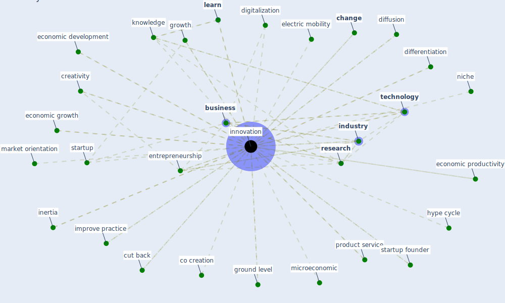

# Keyword: innovation

## Keywords

 * absorptive capacity, alternative product and service, bankruptcy code, blockchain inhealthcare, bre, bre bre, [breeam](keyword_breeam), breeam criterion, [business](keyword_business), capacity, catalyze, [change](keyword_change), co creation, cognitive, complex, [construction](keyword_construction), creative idea, creativity, cut back, development, differentiation, diffusion, diffusion of innovation, digitale teknologi, digitalization, eco design, [economic](keyword_economic), economic development, economic growth, economic productivity, [education](keyword_education), electric mobility, [entrepreneurship](keyword_entrepreneurship), exponentialtechnology, ground level, growth, hype cycle, improve practice, improvisation, [industry](keyword_industry), inertia, inertia inherent in the system, information technology, ingenuity, [innovation](keyword_innovation), innovations, innovator, justi cation, [knowledge](keyword_knowledge), [learn](keyword_learn), learn experience, low carbon, [management](keyword_management), market lead solution, market orientation, [marketing](keyword_marketing), method of construction, microeconomic, mission oriented innovation policies, modernisation of healthcare, [network](keyword_network), new technology, niche, overcome obstacle, pilot, pilot forms, pro change, product chain, product service, production, production system, proximity and innovation, public policy, pvp1 pvp2 pvp3 pvp4 pvp5 respond gbcs indicator weight by well innovation 101 1 3 innovation 102 1 3 innovation 103 1 3 innovation 104 1 3 innovation 105 1 3 healthy entrance 1 3 n a, r d, [research](keyword_research), resource management, self checkout counter, service delivery, service ecosystem, [social](keyword_social), [startup](keyword_startup), startup founder, suptech, [technology](keyword_technology), technology and innovation, teknologi, theorize, udvikle, [urban governance](keyword_urban_governance), vacuum, value creation, [work base learn](keyword_work_base_learn)

## Mapping

## Neighbours

### Closest articles

* How COVID-19 Could Accelerate the Adoption of New Retail Technologies and Enhance the (E-)Servicescape - [LINK](article_willems_how_2021)
* <scp>COVID</scp>             ‐19: Small and medium enterprises challenges and responses with creativity, innovation, and entrepreneurship - [LINK](article_thukral_covid19_2021)
* Startups in times of crisis – A rapid response to the COVID-19 pandemic - [LINK](article_kuckertz_startups_2020)
* Proximity and post-COVID-19 urban development: Reflections from Milan, Italy - [LINK](article_tricarico_proximity_2021)
* COVID-19 risks and systemic gaps in Nigeria: resilience building lessons for pandemic and climate change management - [LINK](article_lawal_covid-19_2022)
* Contextualizing the Covid-19 pandemic for a carbon-constrained world: Insights for sustainability transitions, energy justice, and research methodology - [LINK](article_sovacool_contextualizing_2020)
* Overcoming the Impact of COVID-19 Using Integrated Project Delivery Model - [LINK](article_g_overcoming_2020)
* COVID-19: IMPACT OF THE PANDEMIC ON THE SUSTAINABLE DEVELOPMENT GOALS - [LINK](article_samout_covid-19_2020)
* Strengthening resilience: a priority shared by Health 2020 and - [LINK](article_who_strengthening_2017)
* Health, Wellbeing \& Productivity in Offices - [LINK](article_world_green_building_council_health_2014)

### Closest BPs

