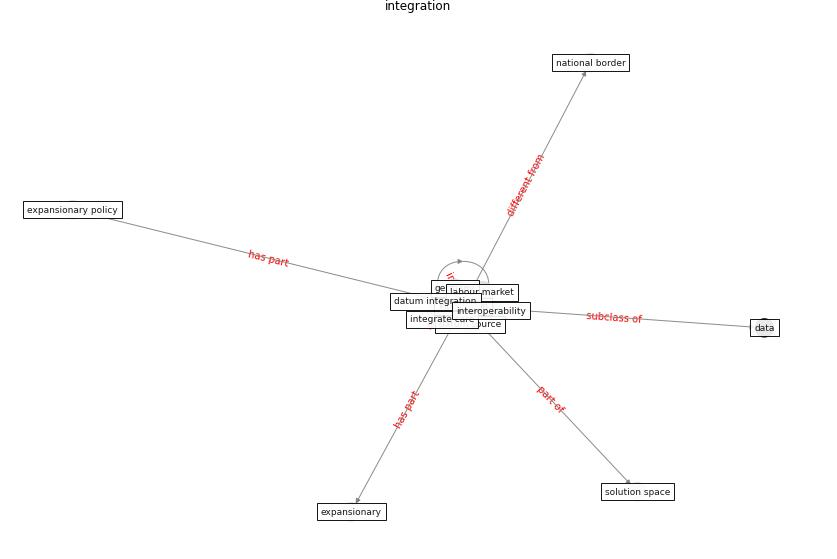

# Keyword: __integration__
## Clusters

* Cluster 15: [ontology-datum](cluster_15)

## Concepts

 

## Articles
* An Intelligent IEQ Monitoring and Feedback
System: Development and Applications ([geng_intelligent_2021](article_geng_intelligent_2021))
* Impact of COVID-19 on IoT Adoption in Healthcare,
Smart Homes, Smart Buildings, Smart Cities,
Transportation and Industrial IoT ([umair_impact_2021](article_umair_impact_2021))
* Borders and Catastrophe: lessons from COVID-19 for the
European Green Deal ([klein_borders_2021](article_klein_borders_2021))
* An Overview of Ontologies and Tool Support for
COVID-19 Analytics ([ahmad_overview_2021](article_ahmad_overview_2021))
* What has been the impact of the COVID-19 pandemic on
immigrants? An update on recent evidence ([oecd_what_2022](article_oecd_what_2022))
* A Comprehensive Review of the COVID-19 Pandemic
and the Role of IoT, Drones, AI, Blockchain, and
5G in Managing its Impact ([chamola_comprehensive_2020](article_chamola_comprehensive_2020))
* realdania_refleksioner_2022_EN-1150 ([realdania_refleksioner_2022_EN-1150](article_realdania_refleksioner_2022_EN-1150))
* eurofund_sustainable_2016-750 ([eurofund_sustainable_2016-750](article_eurofund_sustainable_2016-750))
* From Viral City to Smart City: Learning from
Pandemic Experiences ([sakellarides_viral_2020](article_sakellarides_viral_2020))
* The effect of occupant distribution on energy consumption
and COVID-19 infection in buildings: A case study of
university building ([mokhtari_effect_2021](article_mokhtari_effect_2021))
