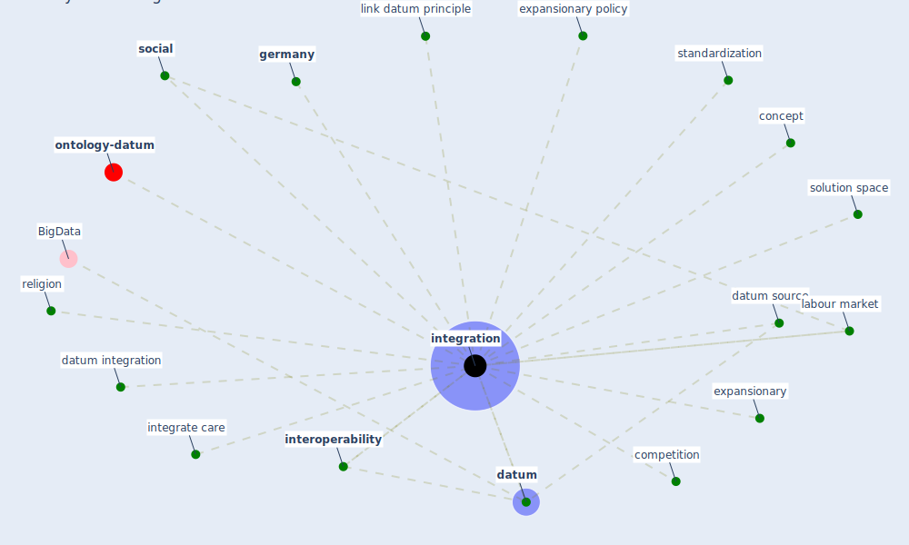

# Keyword: integration

* [ontology-datum](cluster_12)

## Keywords

 * Cluster_12, competition, concept, [datum](keyword_datum), datum integration, datum source, expansionary, expansionary policy, [germany](keyword_germany), integrate care, [integration](keyword_integration), [interoperability](keyword_interoperability), [labour market](keyword_labour_market), link datum principle, religion, [social](keyword_social), solution space, standardization

## Mapping

## Neighbours

### Closest articles

* Impact of COVID-19 on IoT Adoption in Healthcare, Smart Homes, Smart Buildings, Smart Cities, Transportation and Industrial IoT - [LINK](article_umair_impact_2021)
* Addressing vulnerability, building resilience: community-based adaptation to vector-borne diseases in the context of global change - [LINK](article_bardosh_addressing_2017)
* Smart cities and the pandemic: digital technologies on the urban management of Brazilian cities - [LINK](article_fariniuk_smart_2020)
* Urban planning after COVID-19 - [LINK](article_rtpi_urban_2021)
* An Overview of Ontologies and Tool Support for COVID-19 Analytics - [LINK](article_ahmad_overview_2021)
* Sustainable work throughout the life course: National policies and strategies, Publications Office of the European Union - [LINK](article_eurofund_sustainable_2016)
* An Intelligent IEQ Monitoring and Feedback System: Development and Applications - [LINK](article_geng_intelligent_2021)
* Borders and Catastrophe: lessons from COVID-19 for the European Green Deal - [LINK](article_klein_borders_2021)
* A Comprehensive Review of the COVID-19 Pandemic and the Role of IoT, Drones, AI, Blockchain, and 5G in Managing its Impact - [LINK](article_chamola_comprehensive_2020)

### Closest BPs

