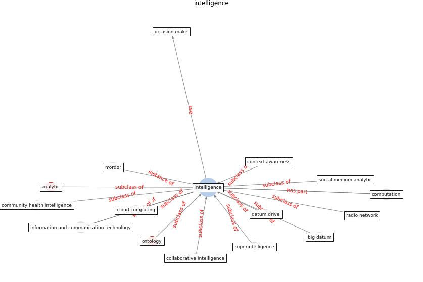

# Keyword: __intelligence__
## Clusters

* Cluster 1: [health-ai](cluster_1)

## Concepts

 

## Top 10 articles for __intelligence__
* Impact of COVID-19 on IoT Adoption in Healthcare,
Smart Homes, Smart Buildings, Smart Cities,
Transportation and Industrial IoT ([umair_impact_2021](article_umair_impact_2021))
* nassereddine_propositions_2021 ([nassereddine_propositions_2021](article_nassereddine_propositions_2021))
* From Viral City to Smart City: Learning from
Pandemic Experiences ([sakellarides_viral_2020](article_sakellarides_viral_2020))
* An Overview of Ontologies and Tool Support for
COVID-19 Analytics ([ahmad_overview_2021](article_ahmad_overview_2021))
* Scalable IoT Architecture for Monitoring IEQ
Conditions in Public and Private Buildings ([calvo_scalable_2022](article_calvo_scalable_2022))
* What drives unverified information sharing and
cyberchondria during the COVID-19 pandemic? ([laato_what_2020](article_laato_what_2020))
* Pandemic stricken cities on lockdown. Where are our
planning and design professionals [now, then and into the
future]? ([allam_pandemic_2020](article_allam_pandemic_2020))
* Emerging Technologies to Combat the COVID-19
Pandemic ([vaishya_emerging_2020](article_vaishya_emerging_2020))
* The role of 5G for digital healthcare against COVID-19
pandemic: Opportunities and challenges ([siriwardhana_role_2021](article_siriwardhana_role_2021))
* Future (post-COVID) digital, smart and sustainable
cities in the wake of 6G: Digital twins, immersive
realities and new urban economies ([allam_future_2021](article_allam_future_2021))
