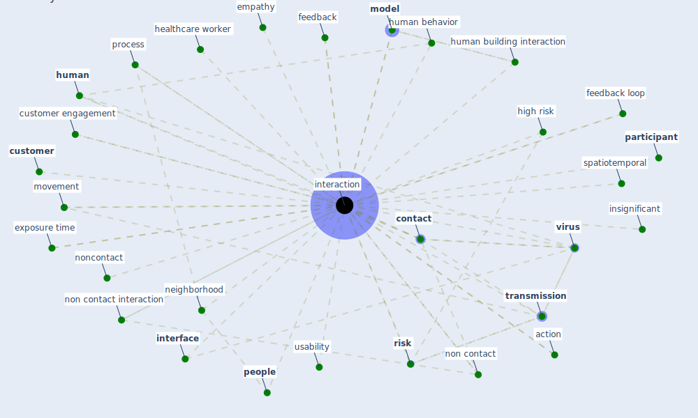

# Keyword: interaction

## Keywords

 * accessibility, action, actor, [agent](keyword_agent), autonomous human behaviour, behaviour, city and environment interaction, community life circle, community service, [contact](keyword_contact), contact interaction, [contamination](keyword_contamination), content of exchange, contexts, convection, [covid 19 pandemic](keyword_covid_19_pandemic), [covid-19](keyword_covid-19), cross regional, culturally, [customer](keyword_customer), customer engagement, customer service, decision make, empathy, [employee](keyword_employee), exposure time, face to face, face to face contact, feedback, feedback loop, feedback loops, group, group interaction, healthcare worker, high risk, [human](keyword_human), human behavior, human behaviour, human building, human building interaction, human oriented, [ibem](keyword_ibem), [ieq](keyword_ieq), [indirect](keyword_indirect), individualize, informal, [information](keyword_information), information asymmetry, information interaction, insig nificant, insignificant, [interaction](keyword_interaction), interaction datum, interactions, [interface](keyword_interface), interview, [learn](keyword_learn), [model](keyword_model), moderator effect, modulator effect, movement, multimodal, [neighborhood](keyword_neighborhood), new normal, non contact, [non contact interaction](keyword_non_contact_interaction), non contract interaction, noncontact, noncontact interaction, [participant](keyword_participant), [people](keyword_people), person to person, [physical](keyword_physical), policy area, policy coordination, process, reason, reinforcing effect, [relationship](keyword_relationship), relationship building, [risk](keyword_risk), risk of interaction, service delivery, service provision, service system, significant, [simulation](keyword_simulation), [social](keyword_social), socialization, spatiotemporal, surface touch, [technology](keyword_technology), time delay, [transmission](keyword_transmission), usability, [user](keyword_user), [virus](keyword_virus), virus transmission, [worker](keyword_worker), workspace

## Mapping

## Neighbours

### Closest articles

* Urban Community Sustainable Development Patterns under the Influence of COVID-19: A Case Study Based on the Non-Contact Interaction Perspective of Hangzhou City - [LINK](article_wang_urban_2021)
* Designing a Multi-Agent Occupant Simulation System to Support Facility Planning and Analysis for COVID-19 - [LINK](article_lee_designing_2021)
* How COVID-19 Could Accelerate the Adoption of New Retail Technologies and Enhance the (E-)Servicescape - [LINK](article_willems_how_2021)
* An Intelligent IEQ Monitoring and Feedback System: Development and Applications - [LINK](article_geng_intelligent_2021)
* The socio-economic determinants of COVID-19: A spatial analysis of German county level data - [LINK](article_ehlert_socio-economic_2021)
* Assessment of COVID-19 precautionary measures in sports facilities: A case study on a health club in Saudi Arabia - [LINK](article_ibrahim_assessment_2022)
* EXPOSED: An occupant exposure model for confined spaces to retrofit crowd models during a pandemic - [LINK](article_ronchi_exposed_2020)
* A Review on Building Design as a Biomedical System for Preventing COVID-19 Pandemic - [LINK](article_amran_review_2022)
* Mapping research in logistics and supply chain management during COVID-19 pandemic - [LINK](article_montoya-torres_mapping_2021)
* Understanding the role of urban design in disease spreading - [LINK](article_brizuela_understanding_2019)

### Closest BPs

