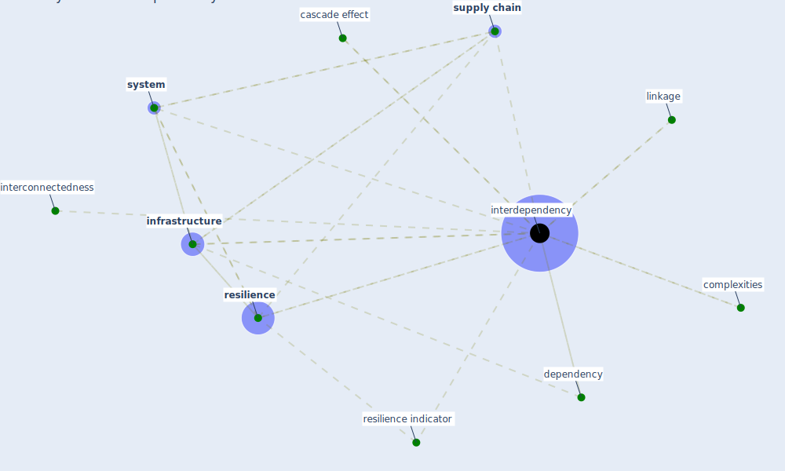

# Keyword: interdependency

## Keywords

 * cascade effect, complexities, [dependency](keyword_dependency), [infrastructure](keyword_infrastructure), interconnectedness, interdependencies, [interdependency](keyword_interdependency), linkage, [resilience](keyword_resilience), resilience indicator, [supply chain](keyword_supply_chain), [system](keyword_system)

## Mapping

## Neighbours

### Closest articles

* Preparing critical infrastructure for the future: Lessons learnt from the Covid-19 pandemic - [LINK](article_tomalska_preparing_2022)
* Decision Making within the Built Environment as a Strategy for Mitigating the Risk of Malaria and Other Vector-Borne Diseases - [LINK](article_obonyo_decision_2018)
* COVID-19 and a new resilient infrastructure landscape - [LINK](article_oecd_covid-19_2021)
* A review of definitions and measures of system resilience - [LINK](article_hosseini_review_2016)
* Perception of COVID-19 impacts on the construction industry over time - [LINK](article_rokooei_perception_2022)
* COVID-19 as a Harbinger of Transforming Infrastructure Resilience - [LINK](article_carvalhaes_covid-19_2020)
* Responsible Transport: A post-COVID agenda for transport policy and practice - [LINK](article_budd_responsible_2020)

### Closest BPs

