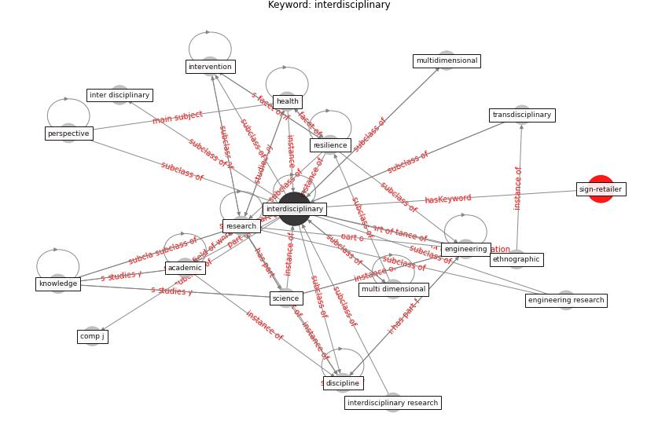

# Keyword: interdisciplinary

* [sign-retailer](cluster_Cluster_8)

## Keywords

 * Cluster_8, [academic](keyword_academic), comp j, discipline, [engineering](keyword_engineering), engineering research, ethnographic, [health](keyword_health), inter disciplinary, [interdisciplinary](keyword_interdisciplinary), interdisciplinary research, intervention, [knowledge](keyword_knowledge), multi dimensional, multidimensional, [perspective](keyword_perspective), [research](keyword_research), [resilience](keyword_resilience), science, transdisciplinary

## Concepts

 

## Neighbours

### Closest articles

* Indoor Air Quality: Rethinking rules of building design strategies in post-pandemic architecture - [LINK](article_megahed_indoor_2021)
* Urban Green Infrastructure and Green Open Spaces: An Issue of Social Fairness in Times of COVID-19 Crisis - [LINK](article_reinwald_urban_2021)
* Validity of energy social research during and after COVID-19: challenges, considerations, and responses - [LINK](article_fell_validity_2020)
*  - [LINK](article_dalessandro_covid-19_2020)
* COVID-19 Higher Mortality in Chinese Regions With Chronic Exposure to Lower Air Quality - [LINK](article_pansini_covid-19_2021)
* Mobility Behaviour in View of the Impact of the COVID-19 Pandemic—Public Transport Users in Gdansk Case Study - [LINK](article_przybylowski_mobility_2021)
* Biophilic design in architecture and its contributions to health, well-being, and sustainability: A critical review - [LINK](article_zhong_biophilic_2022)
* A critical review of heating, ventilation, and air conditioning (HVAC) systems within the context of a global SARS-CoV-2 epidemic - [LINK](article_elsaid_critical_2021)
* How COVID-19 Could Accelerate the Adoption of New Retail Technologies and Enhance the (E-)Servicescape - [LINK](article_willems_how_2021)
* Strengthening resilience: a priority shared by Health 2020 and - [LINK](article_who_strengthening_2017)

### Closest BPs

