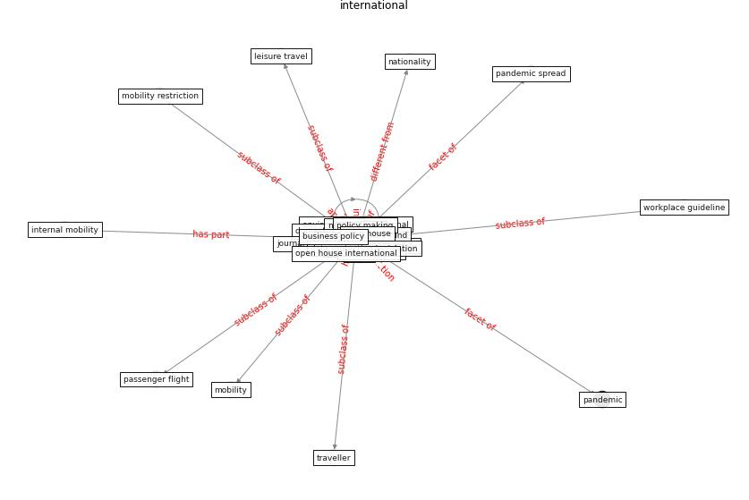

# Keyword: international

* [airport-coating](cluster_Cluster_6)

## Keywords

 * Cluster_6, business policy, china finance review, cooperation, data protection legislation, domestic, domestic destination, energy agency, environment international, finance corporation, forensic science, [globalisation](keyword_globalisation), [government](keyword_government), institution, [international](keyword_international), interstate, labour organization, leisure travel, local, [mobility](keyword_mobility), mobility restriction, monetary fund, monitory fund, national, nationality, open house, open house international, [pandemic](keyword_pandemic), pandemic spread, passenger flight, policy making, political, public health agency, railway journal, [study](keyword_study), [taiwan](keyword_taiwan), [tourism](keyword_tourism), trade, [travel](keyword_travel), traveller, who, who int, workplace guideline, [world bank](keyword_world_bank)

## Concepts

 

## Neighbours

### Closest articles

* COVID-19 Experience Transforming the Protective Environment of Office Buildings and Spaces - [LINK](article_phapant_covid-19_2021)
* Should I Stay or Should I Go? Tourists’ COVID-19 Risk Perception and Vacation Behavior Shift - [LINK](article_bratic_should_2021)
* Coronavirus questions that will not go away: interrogating urban and socio-spatial implications of COVID-19 measures - [LINK](article_salama_coronavirus_2020)
* World Bank Development Report - [LINK](article_world_bank_world_2022)
* Nurture to nature via COVID-19, a self-regenerating environmental strategy of environment in global context - [LINK](article_paital_nurture_2020)
* Urban planning after COVID-19 - [LINK](article_rtpi_urban_2021)
* Designing for COVID-2x: Reflecting on Future-Proofing Human Habitation for the Inevitable Next Pandemic - [LINK](article_spennemann_designing_2022)
* Housing Experience in Gated Communities in the Time of Pandemics: Lessons Learned from COVID-19 - [LINK](article_asfour_housing_2022)
* A Comprehensive Review of the COVID-19 Pandemic and the Role of IoT, Drones, AI, Blockchain, and 5G in Managing its Impact - [LINK](article_chamola_comprehensive_2020)
* Impact of COVID-19 on IoT Adoption in Healthcare, Smart Homes, Smart Buildings, Smart Cities, Transportation and Industrial IoT - [LINK](article_umair_impact_2021)

### Closest BPs

