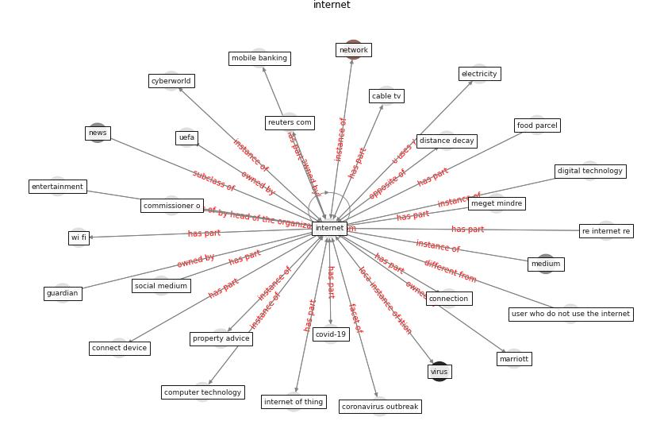

# Keyword: __internet__
## Clusters

* Cluster 10: [fake-medium](cluster_10)

## Concepts

 

## Articles
* COVID-19 media fatigue: predictors of decreasing
interest and avoidance of COVID-19–related news ([buneviciene_covid-19_2021](article_buneviciene_covid-19_2021))
* realdania_refleksioner_2022_EN ([realdania_refleksioner_2022_EN](article_realdania_refleksioner_2022_EN))
* The changes in the effects of social media use of
Cypriots due to COVID-19 pandemic ([kaya_changes_2020](article_kaya_changes_2020))
* What drives unverified information sharing and
cyberchondria during the COVID-19 pandemic? ([laato_what_2020](article_laato_what_2020))
* Learning from the COVID-19 pandemic in governing smart
cities ([bolivar_learning_2022](article_bolivar_learning_2022))
* Design COVID-19 Ontology: A Healthcare and
Safety Perspective ([aloulou_design_2022](article_aloulou_design_2022))
* How the 5G Enabled the COVID-19 Pandemic
Prevention and Control: Materiality, Affordance,
and (De-)Spatialization ([li_how_2022](article_li_how_2022))
* A Mixed Approach on Resilience of Spanish
Dwellings and Households during COVID-19 Lockdown ([cuerdo-vilches_mixed_2020](article_cuerdo-vilches_mixed_2020))
* ecdc_heating_2020 ([ecdc_heating_2020](article_ecdc_heating_2020))
* Future (post-COVID) digital, smart and sustainable
cities in the wake of 6G: Digital twins, immersive
realities and new urban economies ([allam_future_2021](article_allam_future_2021))
