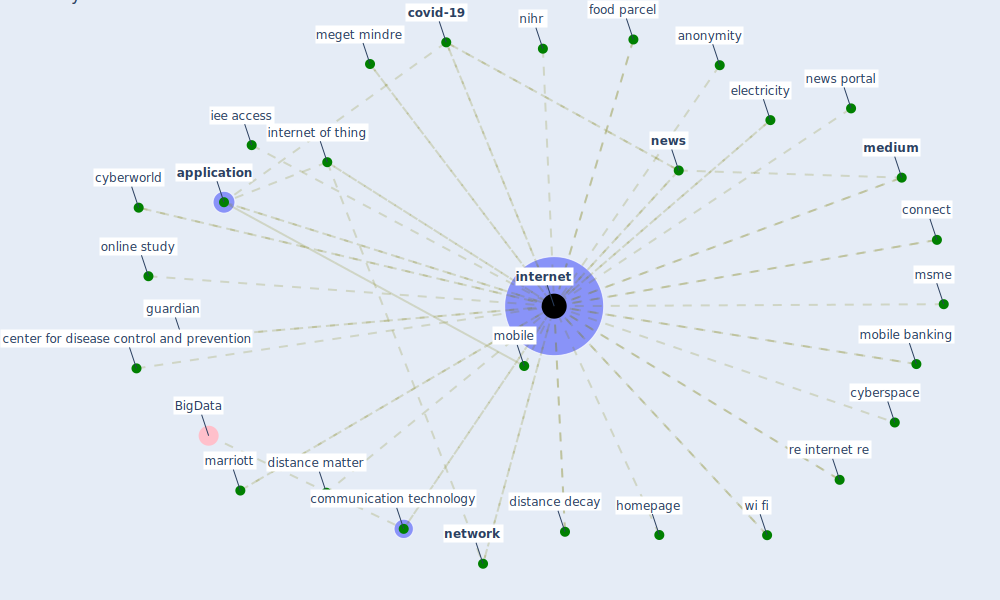

# Keyword: internet

## Keywords

 * 10 year treasury rate, [5 g](keyword_5_g), [5 g network](keyword_5_g_network), access to electricity, airbnb, anonymity, [application](keyword_application), baidu, bbc news, [blockchain](keyword_blockchain), broadband, broadbandconnection, cable tv, center for disease control and prevention, [china](keyword_china), cisco, cloud, cloud computing, commissioner o, communication, communication technology, connect, connect device, [coronavirus outbreak](keyword_coronavirus_outbreak), [country](keyword_country), [covid-19](keyword_covid-19), cyberspace, cyberworld, death of distance, deloitte, [distance](keyword_distance), distance decay, distance matter, electricity, food parcel, guardian, homepage, ibm, iee access, [information](keyword_information), [infrastructure](keyword_infrastructure), [internet](keyword_internet), internet access, internet connection, [internet of thing](keyword_internet_of_thing), internet stock price, itu statistic, kreative, kreative klasse, købte nyanskaffelser, marriott, [medium](keyword_medium), meget mindre, mobile, mobile banking, [monitor](keyword_monitor), msme, [network](keyword_network), [news](keyword_news), news portal, news source, nihr, online study, phone, property advice, re internet re, realtime update, retail, reuters com, science tech, semilockdown, smartphone, socially isolate, sound communication, source of health information, statpearl, stock price, talk, [technology](keyword_technology), telecommunication, the new york times, trade, ubiquitous computing, uefa, uefa com, [united kingdom](keyword_united_kingdom), [united states](keyword_united_states), update, user, user who do not use the internet, vaccine safety activist, vaccine safety activist on the internet, [virus](keyword_virus), vodafone, web application, [wi fi](keyword_wi_fi), wi fi connection, wi fi network, [wifi](keyword_wifi), wifi access point

## Mapping

## Neighbours

### Closest articles

* The socio-economic implications of the coronavirus pandemic (COVID-19): A review - [LINK](article_nicola_socio-economic_2020)
* COVID-19 media fatigue: predictors of decreasing interest and avoidance of COVID-19–related news - [LINK](article_buneviciene_covid-19_2021)
* Design COVID-19 Ontology: A Healthcare and Safety Perspective - [LINK](article_aloulou_design_2022)
* Future (post-COVID) digital, smart and sustainable cities in the wake of 6G: Digital twins, immersive realities and new urban economies - [LINK](article_allam_future_2021)
* Scalable IoT Architecture for Monitoring IEQ Conditions in Public and Private Buildings - [LINK](article_calvo_scalable_2022)
* How the 5G Enabled the COVID-19 Pandemic Prevention and Control: Materiality, Affordance, and (De-)Spatialization - [LINK](article_li_how_2022)
* Impact of COVID-19 on IoT Adoption in Healthcare, Smart Homes, Smart Buildings, Smart Cities, Transportation and Industrial IoT - [LINK](article_umair_impact_2021)
* How COVID-19 Could Accelerate the Adoption of New Retail Technologies and Enhance the (E-)Servicescape - [LINK](article_willems_how_2021)
* The changes in the effects of social media use of Cypriots due to COVID-19 pandemic - [LINK](article_kaya_changes_2020)
* Refleksioner fra en pandemi - [LINK](article_realdania_refleksioner_2022)

### Closest BPs

