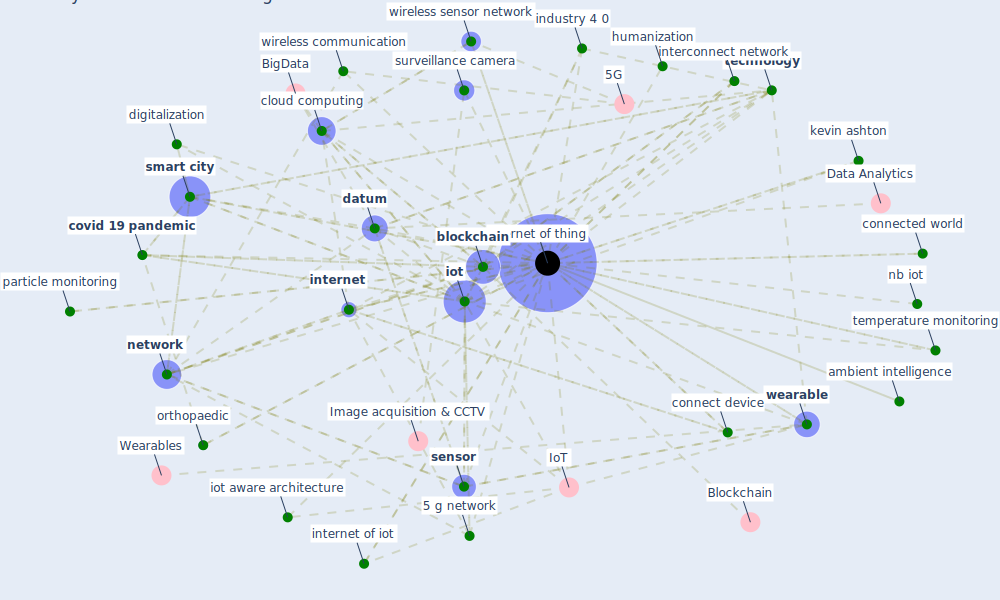

# Keyword: internet of thing

## Keywords

 * 1 internet of thing, 2 1 internet of thing, [5 g network](keyword_5_g_network), IoT, affective, ambient intelligence, [application](keyword_application), [artificial intelligence](keyword_artificial_intelligence), [big datum](keyword_big_datum), big datum analytic, big datum technology, [blockchain](keyword_blockchain), c olakovic, [chinese](keyword_chinese), [cloud](keyword_cloud), cloud computing, connect device, connect device worldwide, connected world, [coronavirus](keyword_coronavirus), [covid 19 pandemic](keyword_covid_19_pandemic), crossref kelly, [datum](keyword_datum), [device](keyword_device), diabetes metab, digitalization, e commerce, edge computing, enable technology, endpoint, [healthcare](keyword_healthcare), humanization, humanize, humanize the internet of thing, ict, ict technology, ieee internet of thing magazine, industrial, industry 4 0, information and communication technology, intelligent remote monitoring, intelligent system, interconnect computing, interconnect network, [internet](keyword_internet), internet of iot, [internet of thing](keyword_internet_of_thing), internet of thing subj iot, internet of things, [iot](keyword_iot), iot aware, iot aware architecture, iot network, iot product, kevin ashton, [medical](keyword_medical), monitoring system, mosenia a, nb iot, [network](keyword_network), network and system, network element, next generation intelligence, orthopaedic, particle monitoring, pervasive computing, privacy and privacy in the internet of thing, [protocol](keyword_protocol), remote monitoring, [sensor](keyword_sensor), sensor network, [smart building](keyword_smart_building), [smart city](keyword_smart_city), smart city datum, surveillance camera, [technology](keyword_technology), temperature monitoring, thing, ubiquitous communication, vision, [wearable](keyword_wearable), wireless communication, wireless communication system, wireless sensor network

## Mapping

## Neighbours

### Closest articles

* Impact of COVID-19 on IoT Adoption in Healthcare, Smart Homes, Smart Buildings, Smart Cities, Transportation and Industrial IoT - [LINK](article_umair_impact_2021)
* Future (post-COVID) digital, smart and sustainable cities in the wake of 6G: Digital twins, immersive realities and new urban economies - [LINK](article_allam_future_2021)
* Leveraging Digital Transformation Technologies to Tackle COVID-19: Proposing a Privacy-First Holistic Framework - [LINK](article_arpaci_leveraging_2021)
* COVID-19 and Green Housing: A Review of Relevant Literature - [LINK](article_kaklauskas_covid-19_2021)
* The Emergence of Anti-Privacy and Control at the Nexus between the Concepts of Safe City and Smart City - [LINK](article_allam_emergence_2019)
* Internet of things (IoT) applications to fight against COVID-19 pandemic - [LINK](article_singh_internet_2020)
* Continuous IEQ monitoring system: Context and development - [LINK](article_parkinson_continuous_2019)
* Scalable IoT Architecture for Monitoring IEQ Conditions in Public and Private Buildings - [LINK](article_calvo_scalable_2022)
* Health Information Exchange with Blockchain amid Covid-19-like Pandemics - [LINK](article_christodoulou_health_2020)
* Smart cities and a data-driven response to COVID-19 - [LINK](article_james_smart_2020)

### Closest BPs

