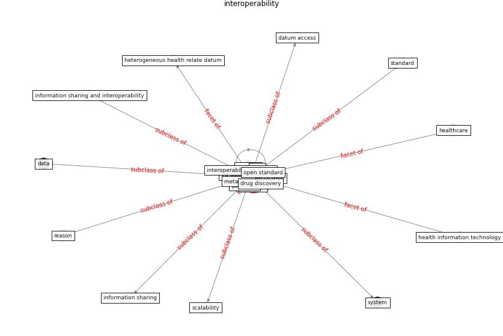

# Keyword: __interoperability__
## Clusters

* Cluster 15: [ontology-datum](cluster_15)

## Concepts

 

## Articles
* Challenges of data sharing in European Covid-19
projects: A learning opportunity for advancing pandemic
preparedness and response ([tacconelli_challenges_2022](article_tacconelli_challenges_2022))
* An Overview of Biomedical Ontologies for Pandemics
and Infectious Diseases Representation ([bayoudhi_overview_2021](article_bayoudhi_overview_2021))
* council_of_europe_2020_2020 ([council_of_europe_2020_2020](article_council_of_europe_2020_2020))
* Health Information Exchange with Blockchain amid
Covid-19-like Pandemics ([christodoulou_health_2020](article_christodoulou_health_2020))
* Mobility Behaviour in View of the Impact of the
COVID-19 Pandemic—Public Transport Users in
Gdansk Case Study ([przybylowski_mobility_2021](article_przybylowski_mobility_2021))
* Scalable IoT Architecture for Monitoring IEQ
Conditions in Public and Private Buildings ([calvo_scalable_2022](article_calvo_scalable_2022))
* CIDO, a community-based ontology for coronavirus disease
knowledge and data integration, sharing, and analysis ([he_cido_2020](article_he_cido_2020))
* An Overview of Ontologies and Tool Support for
COVID-19 Analytics ([ahmad_overview_2021](article_ahmad_overview_2021))
* What drives unverified information sharing and
cyberchondria during the COVID-19 pandemic? ([laato_what_2020](article_laato_what_2020))
* Construction of a Linked Data Set of COVID-19
Knowledge Graphs: Development and Applications ([wang_construction_2022](article_wang_construction_2022))
