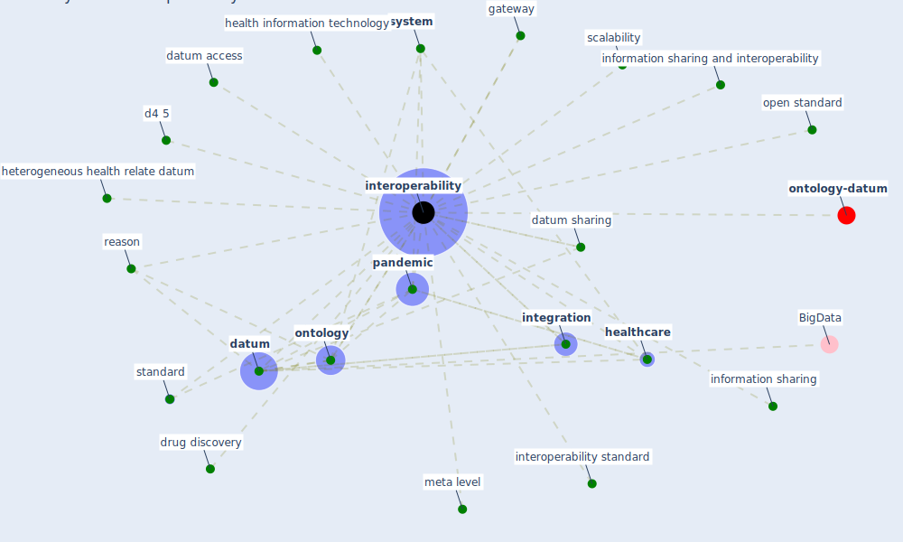

# Keyword: interoperability

* [ontology-datum](cluster_12)

## Keywords

 * Cluster_12, d4 5, [datum](keyword_datum), datum access, [datum sharing](keyword_datum_sharing), drug discovery, gateway, health information technology, [healthcare](keyword_healthcare), heterogeneous health relate datum, information sharing, information sharing and interoperability, [integration](keyword_integration), [interoperability](keyword_interoperability), interoperability standard, meta level, [ontology](keyword_ontology), open standard, [pandemic](keyword_pandemic), reason, scalability, [standard](keyword_standard), [system](keyword_system)

## Mapping

## Neighbours

### Closest articles

* Challenges of data sharing in European Covid-19 projects: A learning opportunity for advancing pandemic preparedness and response - [LINK](article_tacconelli_challenges_2022)
* Pandemic Analytics: How Countries are Leveraging Big Data Analytics and Artificial Intelligence to Fight COVID-19? - [LINK](article_mehta_pandemic_2021)
* An Overview of Biomedical Ontologies for Pandemics and Infectious Diseases Representation - [LINK](article_bayoudhi_overview_2021)
* Health Information Exchange with Blockchain amid Covid-19-like Pandemics - [LINK](article_christodoulou_health_2020)
* An Overview of Ontologies and Tool Support for COVID-19 Analytics - [LINK](article_ahmad_overview_2021)
* Scalable IoT Architecture for Monitoring IEQ Conditions in Public and Private Buildings - [LINK](article_calvo_scalable_2022)
* 2020 Data Protection Report - [LINK](article_council_of_europe_2020_2020)
* CIDO, a community-based ontology for coronavirus disease knowledge and data integration, sharing, and analysis - [LINK](article_he_cido_2020)
* What drives unverified information sharing and cyberchondria during the COVID-19 pandemic? - [LINK](article_laato_what_2020)
* Mobility Behaviour in View of the Impact of the COVID-19 Pandemic—Public Transport Users in Gdansk Case Study - [LINK](article_przybylowski_mobility_2021)

### Closest BPs

