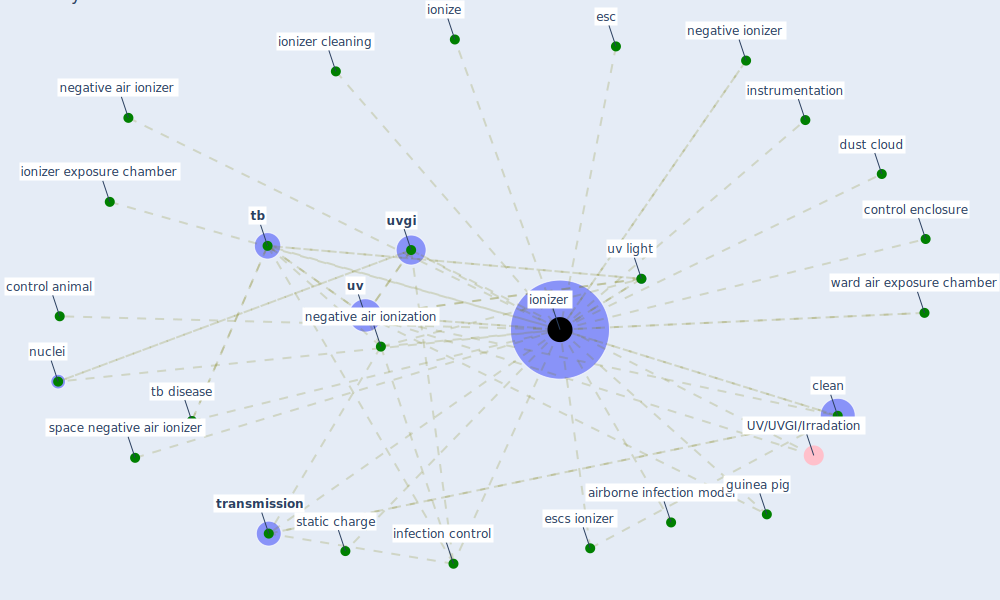

# Keyword: ionizer

## Keywords

 * airborne infection model, [clean](keyword_clean), control animal, control enclosure, dust cloud, esc, escs ionizer, guinea pig, [infection control](keyword_infection_control), instrumentation, ionize, [ionizer](keyword_ionizer), ionizer cleaning, ionizer exposure chamber, ionizers, negative air ionization, negative air ionizer, negative ionizer, nuclei, space negative air ionizer, static charge, [tb](keyword_tb), tb disease, [transmission](keyword_transmission), [uv](keyword_uv), [uv light](keyword_uv_light), [uvgi](keyword_uvgi), ward air exposure chamber

## Mapping

## Neighbours

### Closest articles

* Upper-Room Ultraviolet Light and Negative Air Ionization to Prevent Tuberculosis Transmission - [LINK](article_escombe_upper-room_2009)
* Applications of ultraviolet germicidal irradiation disinfection in health care facilities: Effective adjunct, but not stand-alone technology - [LINK](article_memarzadeh_applications_2010)

### Closest BPs

