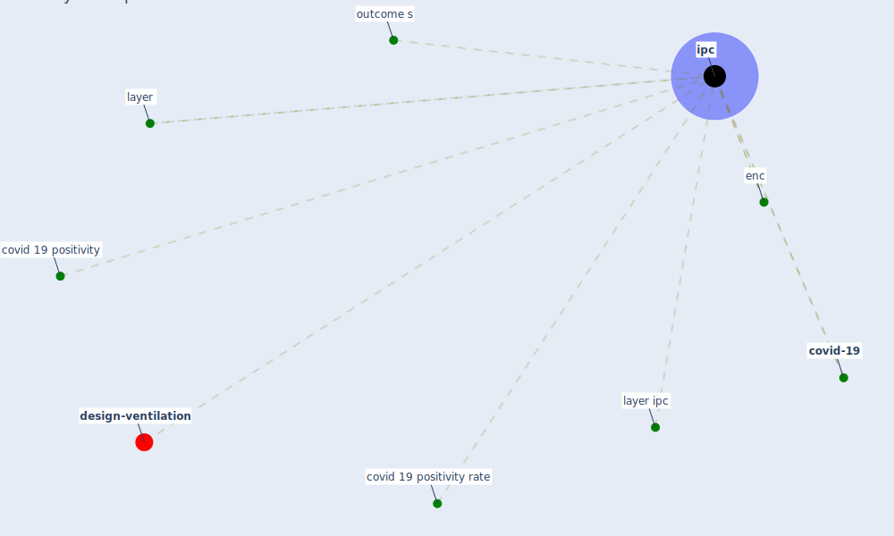

# Keyword: ipc

* [design-ventilation](cluster_12)

## Keywords

 * Cluster_12, covid 19 positivity, covid 19 positivity rate, [covid-19](keyword_covid-19), enc, [ipc](keyword_ipc), layer, layer ipc, outcome s

## Mapping

## Neighbours

### Closest articles

* COVID-19 Prevention and Control Measures in Workplace Settings: A Rapid Review and Meta-Analysis - [LINK](article_ingram_covid-19_2021)
* Health, Economic and Social Development Challenges of the COVID-19 Pandemic: Strategies for Multiple and Interconnected Issues - [LINK](article_panneer_health_2022)
* The efficacy of social distance and ventilation effectiveness in preventing COVID-19 transmission - [LINK](article_sun_efficacy_2020)

### Closest BPs

