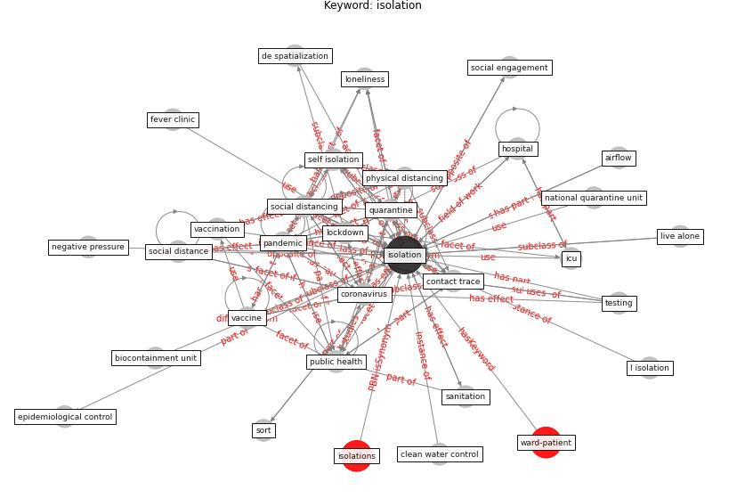

# Keyword: isolation

* [ward-patient](cluster_Cluster_15)

## Keywords

 * Cluster_15, I isolation, airflow, [antimicrobial](keyword_antimicrobial), barrier, biocontainment unit, [build](keyword_build), [building](keyword_building), case isolation, causal factor, causality, clean water control, contact trace, [control](keyword_control), [coronavirus](keyword_coronavirus), covid pandemic, [de spatialization](keyword_de_spatialization), dedicated toilet, [economy](keyword_economy), epidemiological control, fever clinic, [gate](keyword_gate), [health care provider](keyword_health_care_provider), herrick, [hospital](keyword_hospital), [icu](keyword_icu), icu ward, indlæggelse I isolation me covid 19, infect people, [infection](keyword_infection), [infectious disease](keyword_infectious_disease), inter relationship, isolate, [isolation](keyword_isolation), isolations, limited access to workplace, live alone, lock down, [lockdown](keyword_lockdown), lockdown and social distancing norm, [loneliness](keyword_loneliness), mandatory quarantine, national quarantine unit, negative pressure, not ready at all for epidemic, [pandemic](keyword_pandemic), partial isolation, partial isolation level, particulate air filtration, pavilion, perifere, [personal protective equipment](keyword_personal_protective_equipment), physical distancing, post pandemic era, post-pandemic, potentially contaminate, potentially contaminate resident, prevent further transmission, psychological condition, [public health](keyword_public_health), [public space](keyword_public_space), quantification, [quarantine](keyword_quarantine), remote worker, respite, sanitation, self isolation, [social](keyword_social), social bonding, [social distance](keyword_social_distance), [social distancing](keyword_social_distancing), social distancing measure, social engagement, [social interaction](keyword_social_interaction), social isolation, sort, [space](keyword_space), stay at home, [testing](keyword_testing), [toilet](keyword_toilet), triage, vaccination, [vaccine](keyword_vaccine), [ward](keyword_ward), [winter](keyword_winter), work environment

## Concepts

 

## Neighbours

### Closest articles

* COVID-ABS: An agent-based model of COVID-19 epidemic to simulate health and economic effects of social distancing interventions - [LINK](article_silva_covid-abs_2020)
* How loneliness is talked about in social media during COVID-19 pandemic: Text mining of 4,492 Twitter feeds - [LINK](article_koh_how_2022)
* How COVID-19 Could Accelerate the Adoption of New Retail Technologies and Enhance the (E-)Servicescape - [LINK](article_willems_how_2021)
*  - [LINK](article_mehtab_alam_role_2021)
* SARS-CoV-2 RNA detection of hospital isolation wards hygiene monitoring during the Coronavirus Disease 2019 outbreak in a Chinese hospital - [LINK](article_wang_sars-cov-2_2020)
* The Intelligent Lockdown: Compliance with COVID-19 Mitigation Measures in the Netherlands - [LINK](article_kuiper_intelligent_2020)
* Management of the COVID-19 pandemic: challenges, practices, and organizational support - [LINK](article_hossny_management_2022)
* How is COVID-19 Experience Transforming Sustainability Requirements of Residential Buildings? A Review - [LINK](article_tokazhanov_how_2020)
* A Global Survey of Infection Control and Mitigation Measures for Combating the Transmission of COVID-19 Pandemic in Buildings Under Facilities Management Services - [LINK](article_sarvari_global_2022)
* Coronavirus questions that will not go away: interrogating urban and socio-spatial implications of COVID-19 measures - [LINK](article_salama_coronavirus_2020)

### Closest BPs

