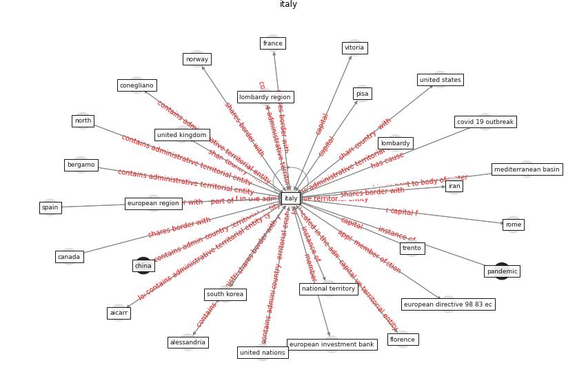

# Keyword: __italy__

## Concepts

 

## Top articles for __italy__
* An environmental and health perspective for COVID-19
outbreak: Meteorology and air quality influence, sewage
epidemiology indicator, hospitals disinfection, drug
therapies and recommendations ([barcelo_environmental_2020](article_barcelo_environmental_2020))
* COVID-19 and Living space challenge. Well-being and
Public Health recommendations for a healthy, safe, and
sustainable housing. ([dalessandro_covid-19_2020](article_dalessandro_covid-19_2020))
* First detection of SARS-CoV-2 in untreated wastewaters
in Italy ([la_rosa_first_2020](article_la_rosa_first_2020))
* Nurture to nature via COVID-19, a self-regenerating
environmental strategy of environment in global context ([paital_nurture_2020](article_paital_nurture_2020))
* Open-source analytics tools for studying the COVID-19
coronavirus outbreak ([wu_open-source_2020](article_wu_open-source_2020))
