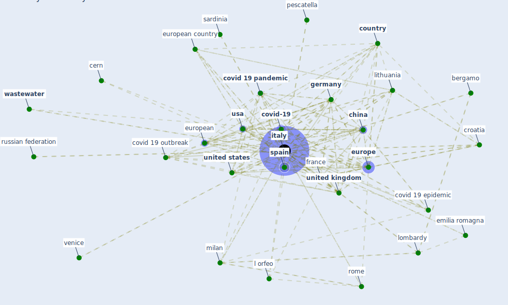

# Keyword: italy

## Keywords

 * I g, I ia, alessandria, baia, bari, bergamo, buonanno, campania, [canada](keyword_canada), cern, [china](keyword_china), china china, conegliano, cornelli, [coronavirus](keyword_coronavirus), coronavirus disease, coun try, [country](keyword_country), covid 19 epidemic, covid 19 lockdown, covid 19 outbreak, [covid 19 pandemic](keyword_covid_19_pandemic), [covid-19](keyword_covid-19), [croatia](keyword_croatia), czech republic, emilia romagna, [europe](keyword_europe), european, european city, european country, european directive, european investment bank, european oecd country, european region, first, florence, [france](keyword_france), [germany](keyword_germany), gorgoglione, health inequality and inadequate housing, [hubei](keyword_hubei), ia, iia, [india](keyword_india), iran, israel, italia, [italy](keyword_italy), l avaro, l orfeo, lithuania, lombardy, lombardy region, malta, mediterr, mediterranean basin, [milan](keyword_milan), [netherland](keyword_netherland), new zealand, north, northern, norway, [oecd](keyword_oecd), ospedale policlinico san martino, [pandemic](keyword_pandemic), pescatella, pescatelli, piedmont, pisa, [portugal](keyword_portugal), ria, [rome](keyword_rome), russian federation, [sar cov 2](keyword_sar_cov_2), sardinia, sesto fiorentino, [slovenia](keyword_slovenia), [south korea](keyword_south_korea), [spain](keyword_spain), supervisory authority, [sweden](keyword_sweden), [switzerland](keyword_switzerland), torino, [toronto](keyword_toronto), trento, trieste, turin, [ug](keyword_ug), [united kingdom](keyword_united_kingdom), [united nations](keyword_united_nations), [united states](keyword_united_states), university of bari, university of padova, university of parma, urban area, [usa](keyword_usa), venice, ventur, vitoria, [wastewater](keyword_wastewater)

## Mapping

## Neighbours

### Closest articles

* Effects of the COVID-19 pandemic on the use and perceptions of urban green space: An international exploratory study - [LINK](article_ugolini_effects_2020)
* First detection of SARS-CoV-2 in untreated wastewaters in Italy - [LINK](article_la_rosa_first_2020)
* Covid-19 and asset management in EU: a preliminary assessment of performance and investment styles - [LINK](article_rizvi_covid-19_2020)
*  - [LINK](article_dalessandro_covid-19_2020)
* A Platform for Citizen Cooperation during the COVID-19 Pandemic in RN, Brazil - [LINK](article_de_araujo_platform_2020)
* Proximity and post-COVID-19 urban development: Reflections from Milan, Italy - [LINK](article_tricarico_proximity_2021)
* Nurture to nature via COVID-19, a self-regenerating environmental strategy of environment in global context - [LINK](article_paital_nurture_2020)
* COVID-19 Lockdown: Housing Built Environment’s Effects on Mental Health - [LINK](article_amerio_covid-19_2020)
* What has been the impact of the COVID-19 pandemic on immigrants? An update on recent evidence - [LINK](article_oecd_what_2022)
* World Bank Development Report - [LINK](article_world_bank_world_2022)

### Closest BPs

