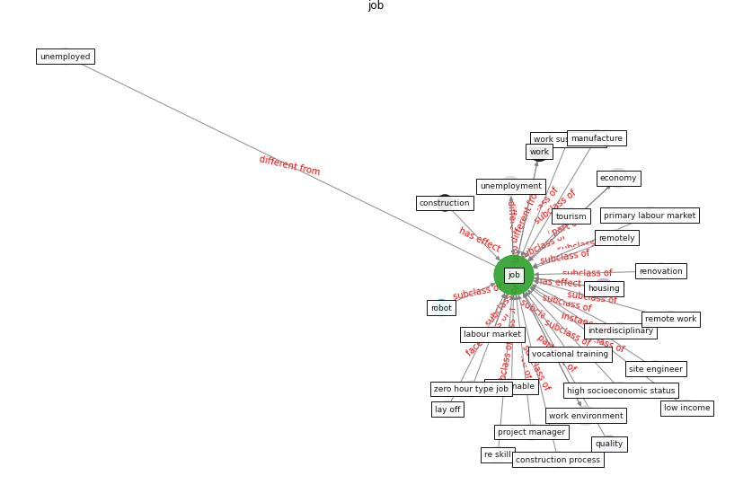

# Keyword: __job__
## Clusters

* Cluster 3: [construction-project](cluster_3)

## Concepts

 

## Articles
* eurofund_sustainable_2016-0 ([eurofund_sustainable_2016-0](article_eurofund_sustainable_2016-0))
* eurofund_sustainable_2016-450 ([eurofund_sustainable_2016-450](article_eurofund_sustainable_2016-450))
* Combating COVID-19—The role of robotics in managing
public health and infectious diseases ([yang_combating_2020](article_yang_combating_2020))
* COVID-ABS: An agent-based model of COVID-19
epidemic to simulate health and economic effects of social
distancing interventions ([silva_covid-abs_2020](article_silva_covid-abs_2020))
* realdania_refleksioner_2022_EN-950 ([realdania_refleksioner_2022_EN-950](article_realdania_refleksioner_2022_EN-950))
* eurofund_sustainable_2016-1250 ([eurofund_sustainable_2016-1250](article_eurofund_sustainable_2016-1250))
* realdania_refleksioner_2022_EN-450 ([realdania_refleksioner_2022_EN-450](article_realdania_refleksioner_2022_EN-450))
* eurofund_sustainable_2016-1150 ([eurofund_sustainable_2016-1150](article_eurofund_sustainable_2016-1150))
* eurofund_sustainable_2016-250 ([eurofund_sustainable_2016-250](article_eurofund_sustainable_2016-250))
* Perception of COVID-19 impacts on the construction
industry over time ([rokooei_perception_2022](article_rokooei_perception_2022))
