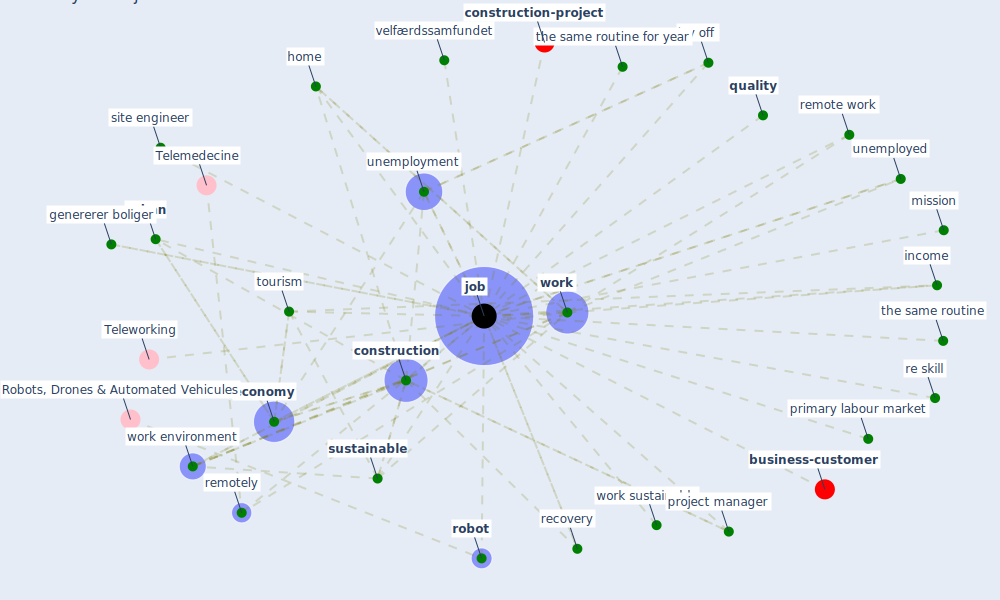

# Keyword: job

* [construction-project](cluster_8)

* [business-customer](cluster_11)

## Keywords

 * Cluster_11, Cluster_8, close down, [construction](keyword_construction), construction process, [economy](keyword_economy), genererer boliger, high socioeconomic status, [home](keyword_home), horticulture, income, [job](keyword_job), jobmuligheder, jobs, [labour market](keyword_labour_market), lay off, livelihood, low income, [manufacture](keyword_manufacture), mission, primary labour market, project manager, [quality](keyword_quality), re skill, [recovery](keyword_recovery), [remote work](keyword_remote_work), remotely, [robot](keyword_robot), site engineer, [sustainable](keyword_sustainable), the same routine, the same routine for year, [tourism](keyword_tourism), unemployed, unemployment, [urban](keyword_urban), velfærdssamfundet, [work](keyword_work), work environment, work sustainable, zero hour type job

## Mapping

## Neighbours

### Closest articles

* Sustainable work throughout the life course: National policies and strategies, Publications Office of the European Union - [LINK](article_eurofund_sustainable_2016)
* Refleksioner fra en pandemi - [LINK](article_realdania_refleksioner_2022)
* A critical analysis of the impacts of COVID-19 on the global economy and ecosystems and opportunities for circular economy strategies - [LINK](article_ibn-mohammed_critical_2021)
* How COVID-19 Could Accelerate the Adoption of New Retail Technologies and Enhance the (E-)Servicescape - [LINK](article_willems_how_2021)
* Perception of COVID-19 impacts on the construction industry over time - [LINK](article_rokooei_perception_2022)
* Covid-19 and the politics of sustainable energy transitions - [LINK](article_kuzemko_covid-19_2020)
* Combating COVID-19—The role of robotics in managing public health and infectious diseases - [LINK](article_yang_combating_2020)
* COVID-ABS: An agent-based model of COVID-19 epidemic to simulate health and economic effects of social distancing interventions - [LINK](article_silva_covid-abs_2020)
* The COVID-19 pandemic: Lessons on building more equal and sustainable societies - [LINK](article_van_barneveld_covid-19_2020)
* Case Study on Finnish TVETA Resilient Model of Training During COVID-19 - [LINK](article_unesco_case_2021)

### Closest BPs

