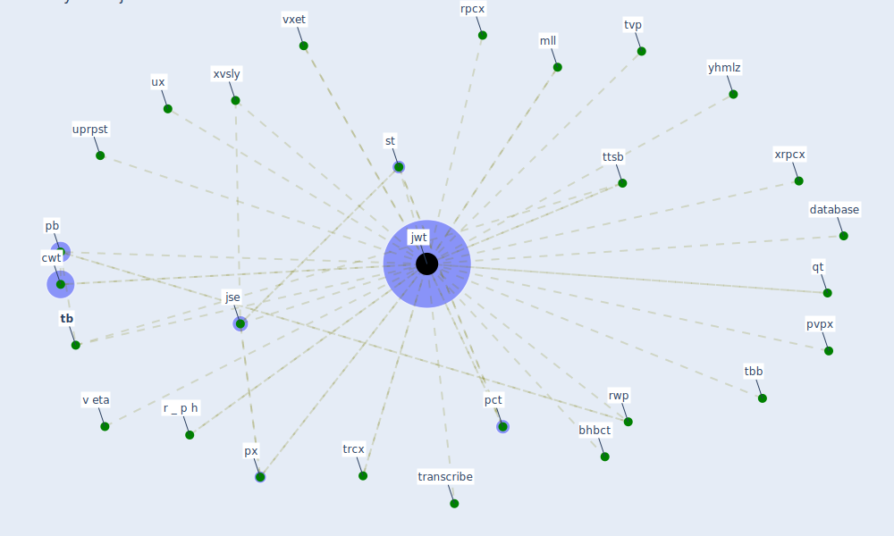

# Keyword: jwt

## Keywords

 * bhbct, [cwt](keyword_cwt), database, [jse](keyword_jse), [jwt](keyword_jwt), mll, [pb](keyword_pb), pct, pvpx, px, qt, r _ p h, rpcx, rwp, st, [tb](keyword_tb), tbb, transcribe, trcx, ttsb, tvp, uprpst, ux, v eta, vxet, xrpcx, xvsly, yhmlz

## Mapping

## Neighbours

### Closest articles

* A Platform for Citizen Cooperation during the COVID-19 Pandemic in RN, Brazil - [LINK](article_de_araujo_platform_2020)

### Closest BPs

