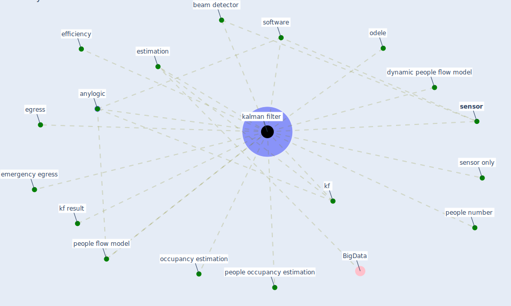

# Keyword: kalman filter

## Keywords

 * [anylogic](keyword_anylogic), beam detector, dynamic people flow model, efficiency, egress, emergency egress, estimation, [kalman filter](keyword_kalman_filter), kf, kf result, occupancy estimation, odele, people number, people occupancy estimation, people flow model, [sensor](keyword_sensor), sensor only, software

## Mapping

## Neighbours

### Closest articles

* Building occupancy estimation with people flow modeling in AnyLogic - [LINK](article_li_building_2016)

### Closest BPs

