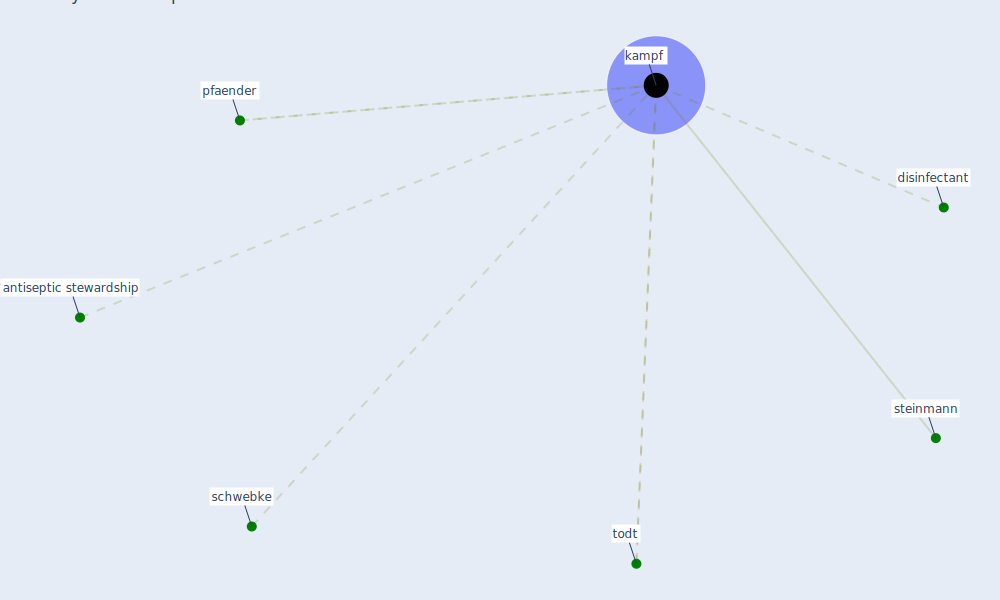

# Keyword: kampf

## Keywords

 * antiseptic stewardship, [disinfectant](keyword_disinfectant), [kampf](keyword_kampf), pfaender, schwebke, steinmann, todt

## Mapping

## Neighbours

### Closest articles

* Persistence of coronaviruses on inanimate surfaces and their inactivation with biocidal agents - [LINK](article_kampf_persistence_2020)
* Learning from pandemics: Applying resilience thinking to identify priorities for planning urban settlements - [LINK](article_syal_learning_2021)
* A review of facilities management interventions to mitigate respiratory infections in existing buildings - [LINK](article_zhang_review_2022)
* Environmental factors involved in SARS-CoV-2 transmission: effect and role of indoor environmental quality in the strategy for COVID-19 infection control - [LINK](article_azuma_environmental_2020)

### Closest BPs

