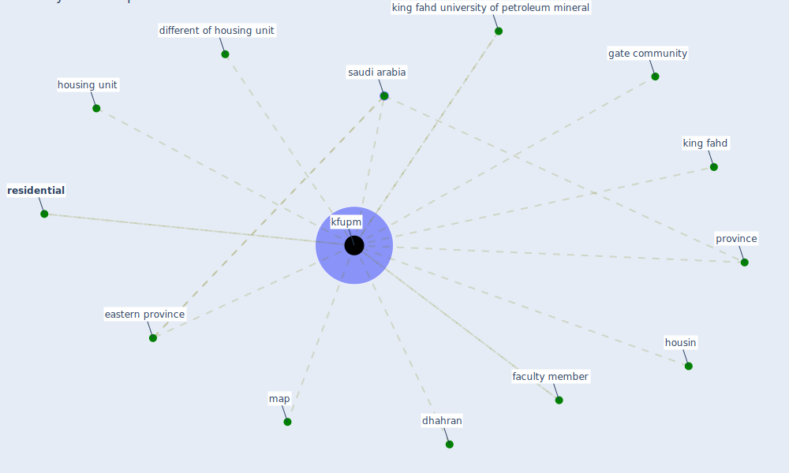

# Keyword: kfupm

## Keywords

 * dhahran, different of housing unit, eastern province, faculty member, [gate community](keyword_gate_community), housin, housing unit, [kfupm](keyword_kfupm), king fahd, king fahd university of petroleum mineral, map, [province](keyword_province), [residential](keyword_residential), [saudi arabia](keyword_saudi_arabia)

## Mapping

## Neighbours

### Closest articles

* Housing Experience in Gated Communities in the Time of Pandemics: Lessons Learned from COVID-19 - [LINK](article_asfour_housing_2022)

### Closest BPs

