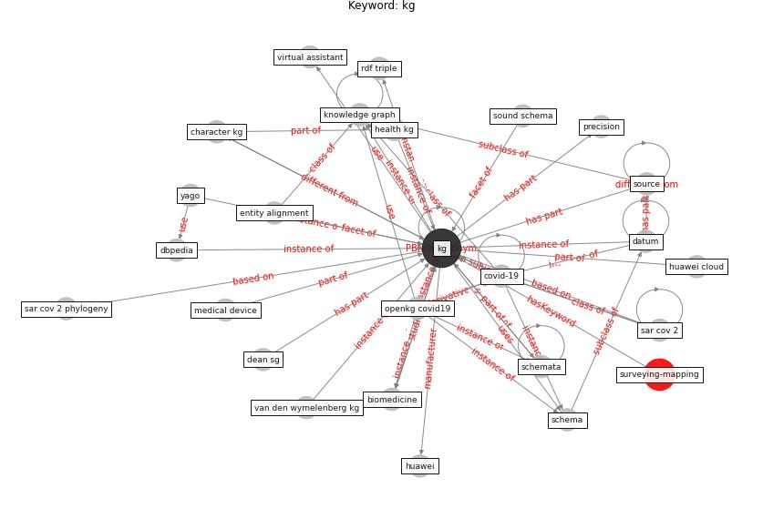

# Keyword: kg

* [surveying-mapping](cluster_Cluster_10)

## Keywords

 * Cluster_10, biomedicine, character kg, [covid-19](keyword_covid-19), [datum](keyword_datum), dbpedia, dean sg, entity alignment, health kg, huawei, huawei cloud, [kg](keyword_kg), [knowledge graph](keyword_knowledge_graph), medical device, [openkg covid19](keyword_openkg_covid19), precision, rdf triple, [sar cov 2](keyword_sar_cov_2), sar cov 2 phylogeny, schema, schemata, sound schema, source, van den wymelenberg kg, virtual assistant, yago

## Concepts

 

## Neighbours

### Closest articles

* Construction of a Linked Data Set of COVID-19 Knowledge Graphs: Development and Applications - [LINK](article_wang_construction_2022)
* 2019 Novel Coronavirus (COVID-19) Pandemic: Built Environment Considerations To Reduce Transmission - [LINK](article_dietz_2019_2020)
* Upper-Room Ultraviolet Light and Negative Air Ionization to Prevent Tuberculosis Transmission - [LINK](article_escombe_upper-room_2009)

### Closest BPs

