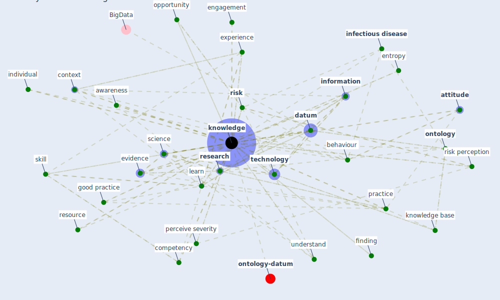

# Keyword: knowledge

## Keywords

 * academic, affiliation, appropriate knowledge, [attitude](keyword_attitude), awareness, behavioral, behaviour, c40, c40 knowledge, citizen science, common sense, common sense knowledge, common sense reasoning, communication, competency, complexity, context, [datum](keyword_datum), datum engineering, dependence, empirical, engagement, entropy, [evidence](keyword_evidence), [experience](keyword_experience), experience lab, good practice, green roof knowledge, high education, individual, [infectious disease](keyword_infectious_disease), inference, informatic, [information](keyword_information), inheritance, [innovation](keyword_innovation), interdisciplinary, influence, kap, [knowledge](keyword_knowledge), knowledge acquisition, knowledge appropriate knowledge, knowledge base, knowledge fountain, knowledge guide, knowledge module, [learn](keyword_learn), literature review, memory, misunderstand, [new](keyword_new), new knowledge, news from media, [ontology](keyword_ontology), opportunity, perceive severity, perception, perception of risk, [policy](keyword_policy), [practice](keyword_practice), predictor, [prevention](keyword_prevention), proximity, [public health](keyword_public_health), public knowledge, publisher, reflective measurement, [research](keyword_research), research agenda, research need, resource, [risk](keyword_risk), [risk perception](keyword_risk_perception), rule base representation, rule base system, science, scientific, semantic, share knowledge, [skill](keyword_skill), skill training, [social](keyword_social), socialization, sociodemographics, specialisation, supply chain finance, [survey](keyword_survey), synthesis, task ontologie, [technology](keyword_technology), theory, [type](keyword_type), type of knowledge, uncertainty, understand, validity, weather condition, well know information, worldview, finding

## Mapping

## Neighbours

### Closest articles

* The impacts of knowledge, risk perception, emotion and information on citizens’ protective behaviors during the outbreak of COVID-19: a cross-sectional study in China - [LINK](article_ning_impacts_2020)
* Knowledge, attitudes, and practices of Indonesian residents regarding COVID-19: A national cross-sectional survey - [LINK](article_yodang_knowledge_2021)
* COVID19-Routes: A Safe Pedestrian Navigation Service - [LINK](article_cantarero_covid19-routes_2021)
* How COVID-19 Could Accelerate the Adoption of New Retail Technologies and Enhance the (E-)Servicescape - [LINK](article_willems_how_2021)
* Navigating Climate Change: Rethinking the Role of Buildings - [LINK](article_cole_navigating_2020)
* Validity of energy social research during and after COVID-19: challenges, considerations, and responses - [LINK](article_fell_validity_2020)
* Propositions for a Resilient, Post-COVID-19 Future for the AEC Industry - [LINK](article_nassereddine_propositions_2021)
* An Overview of Biomedical Ontologies for Pandemics and Infectious Diseases Representation - [LINK](article_bayoudhi_overview_2021)
* Amplifying the role of knowledge translation platforms in the COVID-19 pandemic response - [LINK](article_el-jardali_amplifying_2020)
* Wastewater surveillance for population-wide Covid-19: The present and future - [LINK](article_daughton_wastewater_2020)

### Closest BPs

