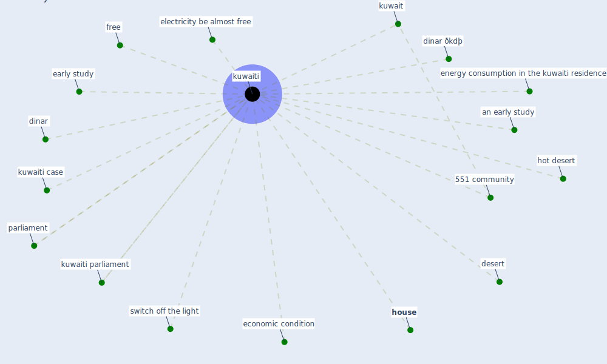

# Keyword: kuwaiti

## Keywords

 * 551 community, an early study, desert, dinar, dinar ðkdþ, early study, economic condition, electricity be almost free, energy consumption in the kuwaiti residence, free, hot desert, [house](keyword_house), [kuwait](keyword_kuwait), [kuwaiti](keyword_kuwaiti), kuwaiti case, kuwaiti parliament, parliament, switch off the light

## Mapping

## Neighbours

### Closest articles

* Occupants’ behavior and activity patterns influencing the energy consumption in the Kuwaiti residences - [LINK](article_al-mumin_occupants_2003)
* Addressing the impact of COVID-19 lockdown on energy use in municipal buildings: A case study in Florianópolis, Brazil - [LINK](article_geraldi_addressing_2021)

### Closest BPs

