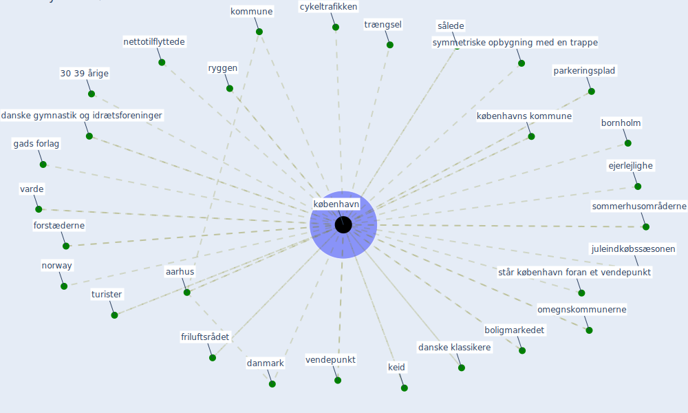

# Keyword: københavn

## Keywords

 * 30 39 årige, aarhus, arkitektforening hu, boliger, boligmarkedet, bornholm, bornholmsk granitlandskab, cykel, cykeltrafikken, cykeltrafikken I københavn, [danmark](keyword_danmark), danmark statistik påviste samtidig, danske byer, danske gymnastik og idrætsforeninger, danske klassikere, [denmark](keyword_denmark), døren mellem to rum dørgrebet, ejerlejlighe, figur, figur 4, forlag, forstæderne, forældresegment, friluftsrådet, gads forlag, gyldendal, indre, indre københavn, juleindkøbssæsonen, keid, kommune, kommunen, kommunen kommune, kommuner, kontaktflade, kontorarbejdspladser, [københavn](keyword_københavn), københavn steg markant, københavns kommune, landsdel, ledige, m trængsel, mange, nettotilflyttede, nettotilflyttede fra københavn, nordsjællandsk løvskov, norway, omegnskommunerne, [pandemien](keyword_pandemien), parkeringsplad, restauranter, ryggen, sommerhusområderne, statistik påviste samtidig, steg markant, står københavn foran et vendepunkt, større, større danske byer, svendborg, symmetriske opbygning med en trappe, sålede, trængsel, turister, varde, velindrettede byrum, velindrettede byrum med et godt mikroklima såsom krøyer have, vendepunkt, vesterbro

## Mapping

## Neighbours

### Closest articles

* Refleksioner fra en pandemi - [LINK](article_realdania_refleksioner_2022)
* Pandemiens arkitektur - [LINK](article_realdania_pandemiens_2022)

### Closest BPs

