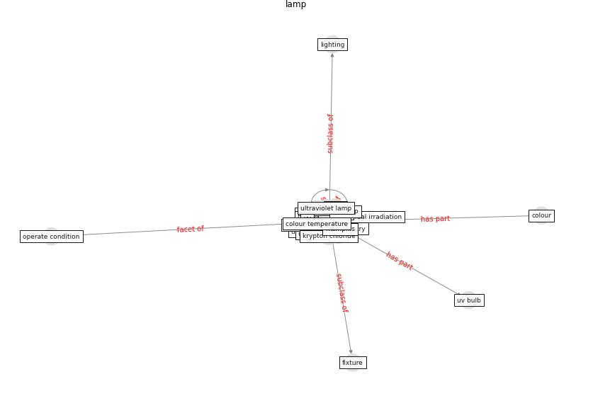

# Keyword: lamp

* [uvc-hcov](cluster_Cluster_7)

## Keywords

 * Cluster_7, bartley fixture, bulb, colour, colour temperature, dosimetry, fixture, kerosene, krypton chloride, [lamp](keyword_lamp), lamps, [lighting](keyword_lighting), luminaire, operate condition, ultraviolet germicidal irradiation, ultraviolet lamp, ultraviolet ray, [uv](keyword_uv), uv bulb, uv lamp, [uv-c](keyword_uv-c), uvc chamber, [uvgi](keyword_uvgi), uvgi lamp

## Concepts

 

## Neighbours

### Closest articles

* Applications of ultraviolet germicidal irradiation disinfection in health care facilities: Effective adjunct, but not stand-alone technology - [LINK](article_memarzadeh_applications_2010)
* Upper-Room Ultraviolet Light and Negative Air Ionization to Prevent Tuberculosis Transmission - [LINK](article_escombe_upper-room_2009)
* Health, Wellbeing \& Productivity in Offices - [LINK](article_world_green_building_council_health_2014)
* Upper-room ultraviolet air disinfection might help to reduce COVID-19 transmission in buildings: a feasibility study - [LINK](article_beggs_upper-room_2020)
* Far-UVC light (222 nm) efficiently and safely inactivates airborne human coronaviruses - [LINK](article_buonanno_far-uvc_2020)
* Air Disinfection for Airborne Infection Control with a Focus on COVID‐19: Why Germicidal UV is Essential             † - [LINK](article_nardell_air_2021)
* Occupants’ behavior and activity patterns influencing the energy consumption in the Kuwaiti residences - [LINK](article_al-mumin_occupants_2003)
* A Review on Building Design as a Biomedical System for Preventing COVID-19 Pandemic - [LINK](article_amran_review_2022)
* Prophylactic Architecture: Formulating the Concept of Pandemic-Resilient Homes - [LINK](article_elrayies_prophylactic_2022)

### Closest BPs

