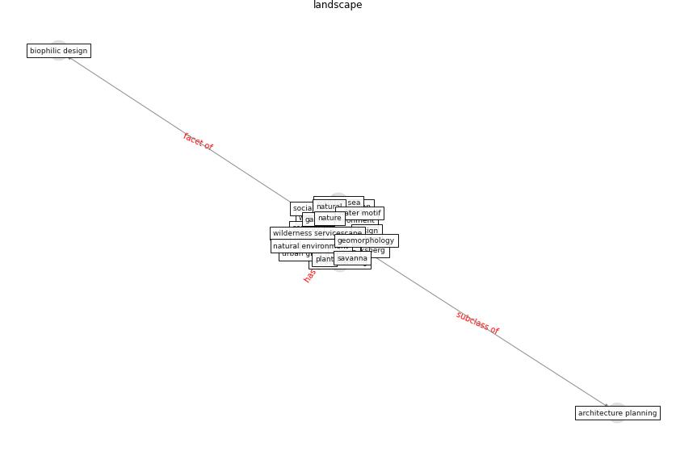

# Keyword: __landscape__
## Clusters

* Cluster 15: [green-urban](cluster_15)

## Concepts

 

## Top 10 articles for __landscape__
* Biophilic design in architecture and its contributions to
health, well-being, and sustainability: A critical
review ([zhong_biophilic_2022](article_zhong_biophilic_2022))
* realdania_refleksioner_2022_EN ([realdania_refleksioner_2022_EN](article_realdania_refleksioner_2022_EN))
* Prophylactic Architecture: Formulating the Concept
of Pandemic-Resilient Homes ([elrayies_prophylactic_2022](article_elrayies_prophylactic_2022))
* Association between indoor-outdoor green features and
psychological health during the COVID-19 lockdown in
Italy: A cross-sectional nationwide study ([spano_association_2021](article_spano_association_2021))
* Home garden use during COVID-19: Associations with
physical and mental wellbeing in older adults ([corley_home_2021](article_corley_home_2021))
* Effects of the COVID-19 pandemic on the use and
perceptions of urban green space: An international
exploratory study ([ugolini_effects_2020](article_ugolini_effects_2020))
* The Impact of COVID-19 on Public Space: A
Review of the Emerging Questions ([honey-roses_impact_2020](article_honey-roses_impact_2020))
* world_green_building_council_health_2014 ([world_green_building_council_health_2014](article_world_green_building_council_health_2014))
* Assessment method for new sustainability indicators
providing pandemic resilience for residential buildings ([tokazhanov_assessment_2021](article_tokazhanov_assessment_2021))
* Exploring the Non-Medical impacts of Covid-19 using
Natural Language Processing ([agade_exploring_2020](article_agade_exploring_2020))
