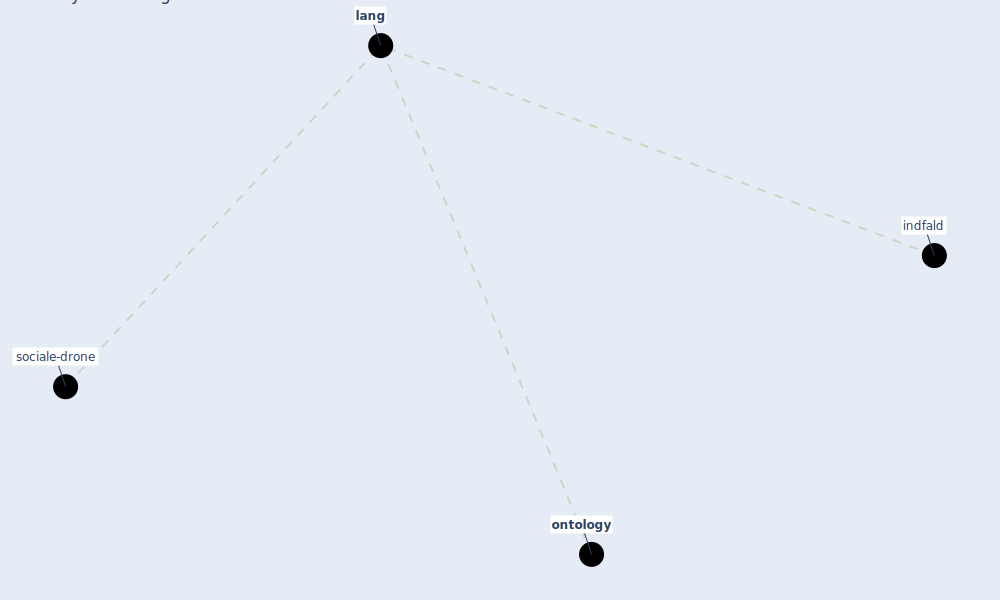

# Keyword: lang

* [sociale-drone](cluster_6)

## Keywords

 * Cluster_6, indfald, [lang](keyword_lang), langs, [ontology](keyword_ontology)

## Mapping

## Neighbours

### Closest articles

* An Overview of Biomedical Ontologies for Pandemics and Infectious Diseases Representation - [LINK](article_bayoudhi_overview_2021)
* Refleksioner fra en pandemi - [LINK](article_realdania_refleksioner_2022)

### Closest BPs

