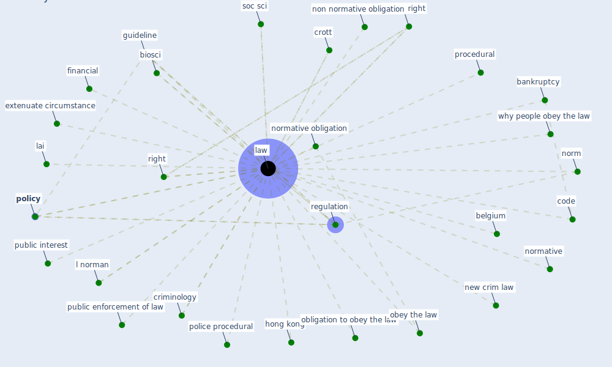

# Keyword: law

## Keywords

 * amend, bankruptcy, belgium, bhattacharyya, biosci, boland, [business](keyword_business), change in law, cheung c law r, cheung c law r lo a, code, compulsory, court system, crim, criminal, criminalise, criminology, crott, decree, deng, [economic](keyword_economic), emergency legislation, enforcement, extenuate circumstance, financial, guideline, [health](keyword_health), [hong kong](keyword_hong_kong), housing law, human right, inequality in health protection, insolvency, k w, kozak, l norman, [labour](keyword_labour), lai, [law](keyword_law), law I, law ethic, laws, lawー, mozambique, national, new crim law, non normative, non normative obligation, norm, normative, normative obligation, obey, obey the law, obligation to obey the law, police, police procedural, [policy](keyword_policy), policymaker, poverty, procedural, procedure, psychology, public enforcement of law, public interest, public interest purpose, regulation, regulatory change, right, rule, sciences, singapore, soc sci, the law of settlement, uzbekistan, von der tann, why people obey the law, [wong](keyword_wong)

## Mapping

## Neighbours

### Closest articles

* The Intelligent Lockdown: Compliance with COVID-19 Mitigation Measures in the Netherlands - [LINK](article_kuiper_intelligent_2020)
* World Bank Development Report - [LINK](article_world_bank_world_2022)
* Compliance with COVID-19 Mitigation Measures in the United States - [LINK](article_van_rooij_compliance_2020)
* Seeing the invisible hand: Underlying effects of COVID-19 on tourists’ behavioral patterns - [LINK](article_li_seeing_2020)
* Eviction, Health Inequity, and the Spread of COVID-19: Housing Policy as a Primary Pandemic Mitigation Strategy - [LINK](article_benfer_eviction_2021)
* How COVID-19 Could Accelerate the Adoption of New Retail Technologies and Enhance the (E-)Servicescape - [LINK](article_willems_how_2021)
* Guidelines for Responding to COVID-19 Pandemic: Best Practices, Impacts, and Future Research Directions - [LINK](article_assaad_guidelines_2021)
* 2020 Data Protection Report - [LINK](article_council_of_europe_2020_2020)
* Readiness Assessment of Green Building Certification Systems for Residential Buildings during Pandemics - [LINK](article_tleuken_readiness_2021)
* Sustainable work throughout the life course: National policies and strategies, Publications Office of the European Union - [LINK](article_eurofund_sustainable_2016)

### Closest BPs

