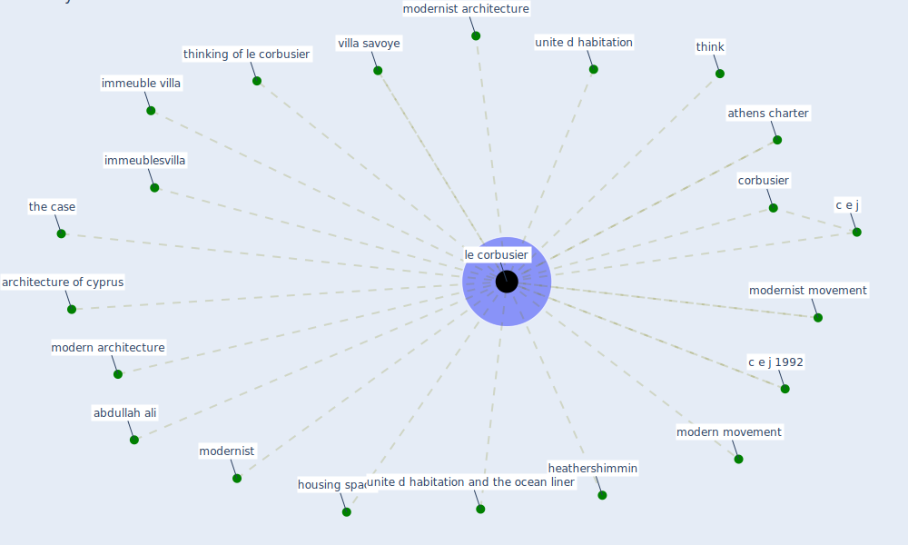

# Keyword: le corbusier

## Keywords

 * abdullah ali, architecture of cyprus, athens charter, c e j, c e j 1992, corbusier, heathershimmin, housing space, immeuble villa, immeublesvilla, [le corbusier](keyword_le_corbusier), modern architecture, modern movement, modernist, modernist architecture, modernist movement, the case, think, thinking of le corbusier, unite d habitation, unite d habitation and the ocean liner, villa savoye

## Mapping

## Neighbours

### Closest articles

* How Architecture Fails in Conditions of Crisis: a Discussion on the Value of Interior Design over the COVID-19 Outbreak - [LINK](article_rassia_how_2020)
* The Role of Architecture and Urbanism in Preventing Pandemics - [LINK](article_kumar_role_2021)
* How the Coronavirus Will Reshape Architecture - [LINK](article_chayka_how_2020)
* Refleksioner fra en pandemi - [LINK](article_realdania_refleksioner_2022)
* Houses amid COVID-19: Environmental challenges and design adaptation - [LINK](article_hizra_houses_2021)
* COVID-19 Could Leverage a Sustainable Built Environment - [LINK](article_pinheiro_covid-19_2020)
* Biophilic design in architecture and its contributions to health, well-being, and sustainability: A critical review - [LINK](article_zhong_biophilic_2022)

### Closest BPs

