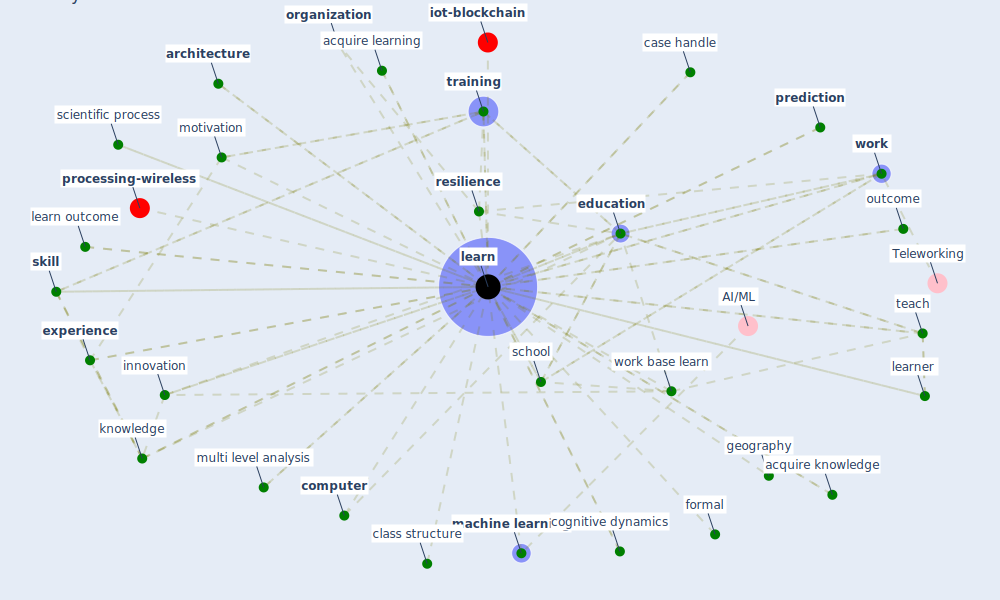

# Keyword: learn

* [iot-blockchain](cluster_7)

* [processing-wireless](cluster_14)

## Keywords

 * Cluster_14, academic conference, acquire knowledge, acquire learning, acquire new skill, [adaptation](keyword_adaptation), [architecture](keyword_architecture), bidirectional, capacity building, case handle, childcare, class structure, cognitive, cognitive dynamics, competency, competency development plan, [computer](keyword_computer), context, culture, decision make, [deep learning](keyword_deep_learning), develop skill, development, distance and online learning, distance learning, e learn, educate, [education](keyword_education), education have be disrupt, [efficiency](keyword_efficiency), emergent problem, [employment](keyword_employment), evolve live experience, [experience](keyword_experience), failure, formal, further study, geography, good practice, group study, hospitality, informal, [information](keyword_information), [innovation](keyword_innovation), [knowledge](keyword_knowledge), [learn](keyword_learn), learn outcome, learned, [learner](keyword_learner), learning, learns, [machine learning](keyword_machine_learning), market sector, mentor, mode of learning and assessment, motivation, multi level analysis, multiform learn environment, neuron, neurons, [noise](keyword_noise), [occsim](keyword_occsim), online class, online learning, operative experience, [organization](keyword_organization), outcome, overfitte, practical, [practice](keyword_practice), predict, [prediction](keyword_prediction), previously unseen samples, prior learn, [project](keyword_project), psychology, qualification, remember, remote learning, remote teaching, [resilience](keyword_resilience), [school](keyword_school), scientific process, sense, share knowledge, share learning, [simulation](keyword_simulation), [skill](keyword_skill), skill demonstration, sparkfun, [system](keyword_system), system level, teach, theory, [training](keyword_training), uncertainty, upskille, upward bias, [work](keyword_work), [work base learn](keyword_work_base_learn)

## Mapping

## Neighbours

### Closest articles

* Case Study on Finnish TVETA Resilient Model of Training During COVID-19 - [LINK](article_unesco_case_2021)
* Sustainable work throughout the life course: National policies and strategies, Publications Office of the European Union - [LINK](article_eurofund_sustainable_2016)
* How COVID-19 Could Accelerate the Adoption of New Retail Technologies and Enhance the (E-)Servicescape - [LINK](article_willems_how_2021)
* An Automated System to Limit COVID-19 Using Facial Mask Detection in Smart City Network - [LINK](article_rahman_automated_2020)
* DeepSOCIAL: Social Distancing Monitoring and Infection Risk Assessment in COVID-19 Pandemic - [LINK](article_rezaei_deepsocial_2020)
* What drives unverified information sharing and cyberchondria during the COVID-19 pandemic? - [LINK](article_laato_what_2020)
* What has been the impact of the COVID-19 pandemic on immigrants? An update on recent evidence - [LINK](article_oecd_what_2022)
* Addressing vulnerability, building resilience: community-based adaptation to vector-borne diseases in the context of global change - [LINK](article_bardosh_addressing_2017)
* Significant applications of virtual reality for COVID-19 pandemic - [LINK](article_singh_significant_2020)
* Scalable IoT Architecture for Monitoring IEQ Conditions in Public and Private Buildings - [LINK](article_calvo_scalable_2022)

### Closest BPs

