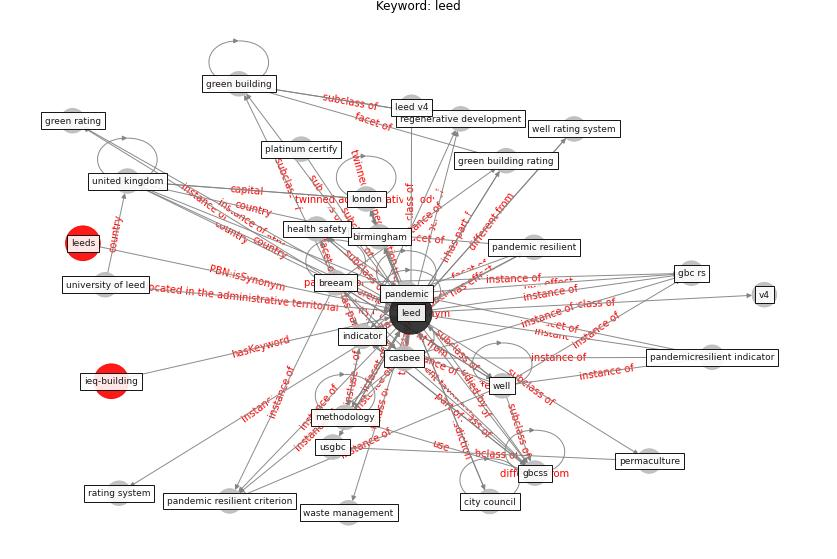

# Keyword: leed

* [ieq-building](cluster_Cluster_11)

## Keywords

 * Cluster_11, birmingham, [breeam](keyword_breeam), breeam system, building certification, building certification system, building research establishment, c breeam, [casbee](keyword_casbee), city council, [climate change](keyword_climate_change), co2, [covid 19 pandemic](keyword_covid_19_pandemic), disinfect, energy star, england, gbc rs, gbc rss, gbcs, [gbcss](keyword_gbcss), ghg, [green building](keyword_green_building), green building certifica tion, green building certification, green building certification and rating system, green building certification system, green building practice, green building rating, green building standard, green rating, [health and safety](keyword_health_and_safety), health safety, [indicator](keyword_indicator), [leed](keyword_leed), leed leed, leed v4, leeds, [london](keyword_london), manchester, merv, methodology, neighborhood development, order, [pandemic](keyword_pandemic), pandemic resilient, pandemic resilient criterion, [pandemic resilient indicator](keyword_pandemic_resilient_indicator), pandemicresilient, pandemicresilient indicator, permaculture, platinum, platinum certify, rating system, regenerative development, regenerative development and design practice, tor, [united kingdom](keyword_united_kingdom), university of leed, usgbc, v4, waste management, [well](keyword_well), well certified building worldwide, well methodology, well rating system

## Concepts

 

## Neighbours

### Closest articles

* Readiness Assessment of Green Building Certification Systems for Residential Buildings during Pandemics - [LINK](article_tleuken_readiness_2021)
* How to Make Green Building Certification &amp; Rating Systems More Pandemic-Sustainable? - [LINK](article_ujikawa_how_2022)
* Assessment method for new sustainability indicators providing pandemic resilience for residential buildings - [LINK](article_tokazhanov_assessment_2021)
* Study of COVID-19 pandemic in London (UK) from urban context - [LINK](article_ghosh_study_2020)
* Navigating Climate Change: Rethinking the Role of Buildings - [LINK](article_cole_navigating_2020)
* Assessment of Building Automation and Control Systems in Danish Healthcare Facilities in the COVID-19 Era - [LINK](article_pedersen_assessment_2022)
* Continuous IEQ monitoring system: Context and development - [LINK](article_parkinson_continuous_2019)
* Attitudes towards outdoor and neighbour noise during the COVID-19 lockdown: A case study in London - [LINK](article_lee_attitudes_2021)
* A review of facilities management interventions to mitigate respiratory infections in existing buildings - [LINK](article_zhang_review_2022)
* An Intelligent IEQ Monitoring and Feedback System: Development and Applications - [LINK](article_geng_intelligent_2021)

### Closest BPs

