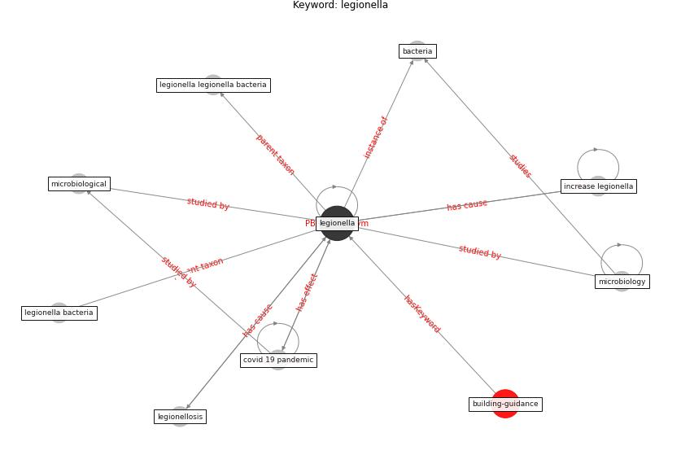

# Keyword: legionella

* [building-guidance](cluster_Cluster_15)

## Keywords

 * Cluster_15, [bacteria](keyword_bacteria), [covid 19 pandemic](keyword_covid_19_pandemic), increase legionella, [legionella](keyword_legionella), legionella bacteria, legionella legionella bacteria, legionellosis, microbiological, microbiology

## Concepts

 

## Neighbours

### Closest articles

* Assessment of Building Automation and Control Systems in Danish Healthcare Facilities in the COVID-19 Era - [LINK](article_pedersen_assessment_2022)
* COVID-19 Experience Transforming the Protective Environment of Office Buildings and Spaces - [LINK](article_phapant_covid-19_2021)
* ASHRAE Position Document on Infectious Aerosols - [LINK](article_ashrae_ashrae_2022)

### Closest BPs

