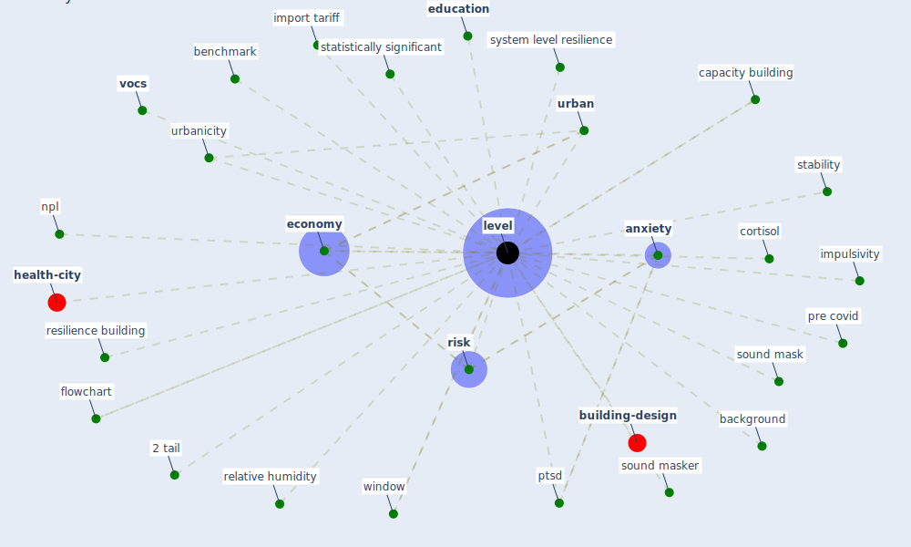

# Keyword: level

* [health-city](cluster_1)

* [building-design](cluster_5)

## Keywords

 * 2 tail, Cluster_1, Cluster_5, [anxiety](keyword_anxiety), background, benchmark, capacity building, cortisol, [economy](keyword_economy), [education](keyword_education), flowchart, import tariff, impulsivity, [level](keyword_level), npl, pre covid, ptsd, relative humidity, resilience building, [risk](keyword_risk), sound mask, sound masker, stability, statistically significant, system level resilience, [urban](keyword_urban), urbanicity, [vocs](keyword_vocs), [window](keyword_window)

## Mapping

## Neighbours

### Closest articles

* Health, Wellbeing \& Productivity in Offices - [LINK](article_world_green_building_council_health_2014)
* Mobile Technology Solution for COVID-19: Surveillance and Prevention - [LINK](article_raza_mobile_2021)
* Global value chains: Efficiency and risks in the context of COVID-19 - [LINK](article_oecd_global_2021)
* Attitudes towards outdoor and neighbour noise during the COVID-19 lockdown: A case study in London - [LINK](article_lee_attitudes_2021)
* Addressing vulnerability, building resilience: community-based adaptation to vector-borne diseases in the context of global change - [LINK](article_bardosh_addressing_2017)
* World Bank Development Report - [LINK](article_world_bank_world_2022)
* How COVID-19 Could Accelerate the Adoption of New Retail Technologies and Enhance the (E-)Servicescape - [LINK](article_willems_how_2021)
* Prophylactic Architecture: Formulating the Concept of Pandemic-Resilient Homes - [LINK](article_elrayies_prophylactic_2022)
* The Effect of Opening Windows on Air Change Rates in Two Homes - [LINK](article_howard-reed_effect_2002)
* Green spaces, especially forest, linked to lower SARS-CoV-2 infection rates: A one-year nationwide study - [LINK](article_jiang_green_2021)

### Closest BPs

