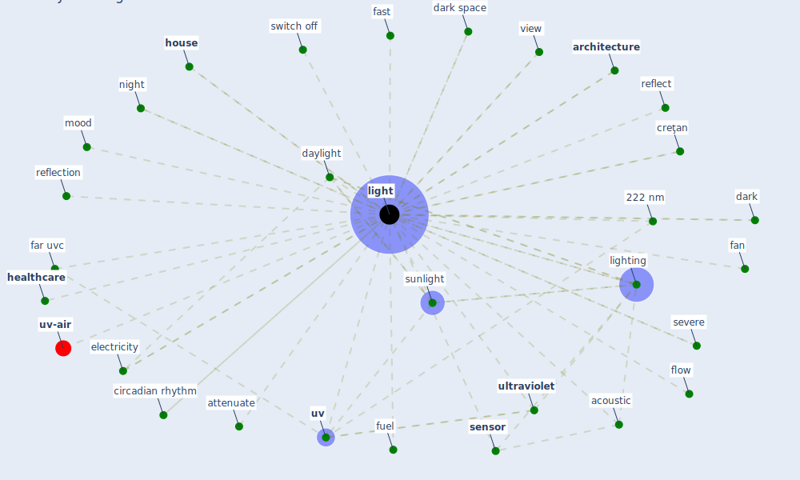

# Keyword: light

* [uv-air](cluster_15)

## Keywords

 * 222 nm, 222 nm uv, Cluster_15, acoustic, [architecture](keyword_architecture), attenuate, blue enrich, bright, circadian rhythm, color, creţan, dark, dark space, daylight, electric, electricity, energy conservation, [environment](keyword_environment), equipment, fan, far uvc, fast, fuel, [healthcare](keyword_healthcare), [house](keyword_house), [hvac](keyword_hvac), incandescent, indoor lighting, ir radiation, [light](keyword_light), lighted, lighting, lights, lit, [mitigation](keyword_mitigation), mood, natural, [nature](keyword_nature), night, [off](keyword_off), reflect, reflection, roof, [sensor](keyword_sensor), severe, [space](keyword_space), spotlight, stair, sunlight, switch off, [ultraviolet](keyword_ultraviolet), [uv](keyword_uv), [uv-c](keyword_uv-c), [ventilation](keyword_ventilation), view, wind speed, [window](keyword_window), workspace, flow

## Mapping

## Neighbours

### Closest articles

* Health, Wellbeing \& Productivity in Offices - [LINK](article_world_green_building_council_health_2014)
* Far-UVC light (222 nm) efficiently and safely inactivates airborne human coronaviruses - [LINK](article_buonanno_far-uvc_2020)
* Occupants’ behavior and activity patterns influencing the energy consumption in the Kuwaiti residences - [LINK](article_al-mumin_occupants_2003)
* Adaptive Design of the Built Environment to Mitigate the Transmission Risk of COVID-19 - [LINK](article_ara_dilshad_shangi_adaptive_2020)
* 2019 Novel Coronavirus (COVID-19) Pandemic: Built Environment Considerations To Reduce Transmission - [LINK](article_dietz_2019_2020)
* Upper-Room Ultraviolet Light and Negative Air Ionization to Prevent Tuberculosis Transmission - [LINK](article_escombe_upper-room_2009)
* Recently employed engineering techniques to reduce the spread of COVID-19 (corona virus disease 2019): a review study - [LINK](article_saman_recently_2021)
* The COVID-19 pandemic: Impacts on cities and major lessons for urban planning, design, and management - [LINK](article_sharifi_covid-19_2020)
* A Review on Building Design as a Biomedical System for Preventing COVID-19 Pandemic - [LINK](article_amran_review_2022)
* Applications of ultraviolet germicidal irradiation disinfection in health care facilities: Effective adjunct, but not stand-alone technology - [LINK](article_memarzadeh_applications_2010)

### Closest BPs

