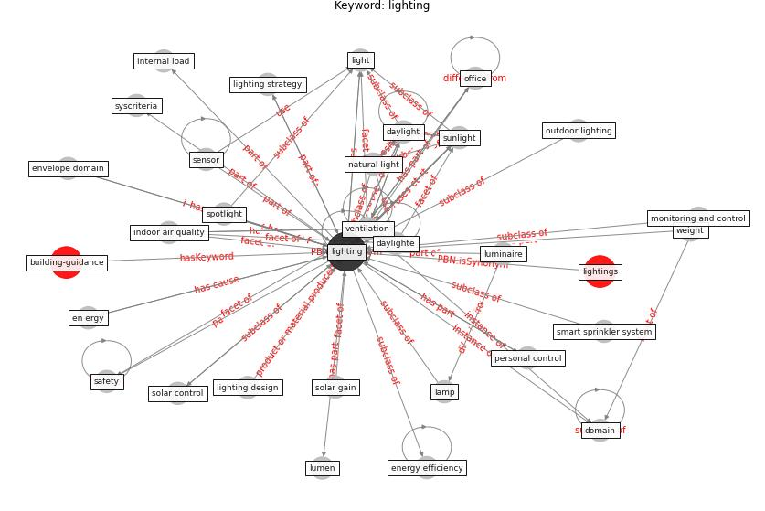

# Keyword: lighting

* [building-guidance](cluster_Cluster_15)

## Keywords

 * Cluster_15, acoustic, artificial lighting, blind, building attribute, building building, bulb, comfort, connect lighting system, [control](keyword_control), daylight, daylighte, [domain](keyword_domain), dynamic electricity, en ergy, [energy consumption](keyword_energy_consumption), [energy efficiency](keyword_energy_efficiency), [energy use](keyword_energy_use), envelope domain, fixture, health and wellbeing, high efficiency, high efficiency lighting, [hvac](keyword_hvac), impact score, [indoor air quality](keyword_indoor_air_quality), industry standard, internal load, kitchen, [lamp](keyword_lamp), [light](keyword_light), [lighting](keyword_lighting), lighting design, lighting level, lighting manufacturer, lighting strategy, lightings, load, low carbon lighting, lumen, luminaire, monitoring and control, natural light, occlusion, [office](keyword_office), outdoor lighting, personal control, physical environment, reflect sunlight, refrigerator, [safety](keyword_safety), [sensor](keyword_sensor), smart sprinkler, smart sprinkler system, solar control, solar gain, spotlight, sunlight, syscriteria, [thermostat](keyword_thermostat), traffic light, uc, [ultraviolet](keyword_ultraviolet), [uv-c](keyword_uv-c), [ventilation](keyword_ventilation), weight

## Concepts

 

## Neighbours

### Closest articles

* Health, Wellbeing \& Productivity in Offices - [LINK](article_world_green_building_council_health_2014)
* Assessment of Building Automation and Control Systems in Danish Healthcare Facilities in the COVID-19 Era - [LINK](article_pedersen_assessment_2022)
* Occupant health in buildings: Impact of the COVID-19 pandemic on the opinions of building professionals and implications on research - [LINK](article_awada_occupant_2022)
* Addressing the impact of COVID-19 lockdown on energy use in municipal buildings: A case study in Florianópolis, Brazil - [LINK](article_geraldi_addressing_2021)
* The effect of occupant distribution on energy consumption and COVID-19 infection in buildings: A case study of university building - [LINK](article_mokhtari_effect_2021)
* A Mixed Approach on Resilience of Spanish Dwellings and Households during COVID-19 Lockdown - [LINK](article_cuerdo-vilches_mixed_2020)
* Impacts of COVID-19 on residential building energy use and performance - [LINK](article_kawka_impacts_2021)
* Readiness Assessment of Green Building Certification Systems for Residential Buildings during Pandemics - [LINK](article_tleuken_readiness_2021)
* Prophylactic Architecture: Formulating the Concept of Pandemic-Resilient Homes - [LINK](article_elrayies_prophylactic_2022)
* An Intelligent IEQ Monitoring and Feedback System: Development and Applications - [LINK](article_geng_intelligent_2021)

### Closest BPs

