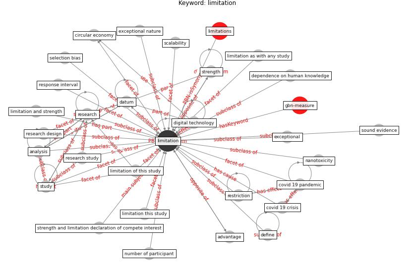

# Keyword: limitation

* [gbn-measure](cluster_Cluster_10)

## Keywords

 * 3 advantage and limitation of the communication process, Cluster_10, advantage, analysis, [circular economy](keyword_circular_economy), [covid 19 crisis](keyword_covid_19_crisis), [covid 19 pandemic](keyword_covid_19_pandemic), [datum](keyword_datum), dependence on human knowledge, define, [digital technology](keyword_digital_technology), exceptional, exceptional nature, [knowledge](keyword_knowledge), limit, [limitation](keyword_limitation), limitation and strength, limitation as with any study, limitation of this study, limitation this study, limitations, manifold, methodology, nanotoxicity, number of participant, [research](keyword_research), research design, research study, response interval, [restriction](keyword_restriction), scalability, selection bias, sound evidence, strength, strength and limitation declaration of compete interest, [study](keyword_study)

## Concepts

 

## Neighbours

### Closest articles

* Perception of COVID-19 impacts on the construction industry over time - [LINK](article_rokooei_perception_2022)
* Influence between COVID-19 Impacts and Project Stakeholders in Chilean Construction Projects - [LINK](article_araya_influence_2021)
* Association between indoor-outdoor green features and psychological health during the COVID-19 lockdown in Italy: A cross-sectional nationwide study - [LINK](article_spano_association_2021)
* Compliance with COVID-19 Mitigation Measures in the United States - [LINK](article_van_rooij_compliance_2020)
* A review of definitions and measures of system resilience - [LINK](article_hosseini_review_2016)
* Mobile Technology Solution for COVID-19: Surveillance and Prevention - [LINK](article_raza_mobile_2021)
* The impacts of knowledge, risk perception, emotion and information on citizens’ protective behaviors during the outbreak of COVID-19: a cross-sectional study in China - [LINK](article_ning_impacts_2020)
* Case Study on Finnish TVETA Resilient Model of Training During COVID-19 - [LINK](article_unesco_case_2021)
* COVID-19 Pandemic: Rethinking Strategies for Resilient Urban Design, Perceptions, and Planning - [LINK](article_afrin_covid-19_2021)
* The Intelligent Lockdown: Compliance with COVID-19 Mitigation Measures in the Netherlands - [LINK](article_kuiper_intelligent_2020)

### Closest BPs

