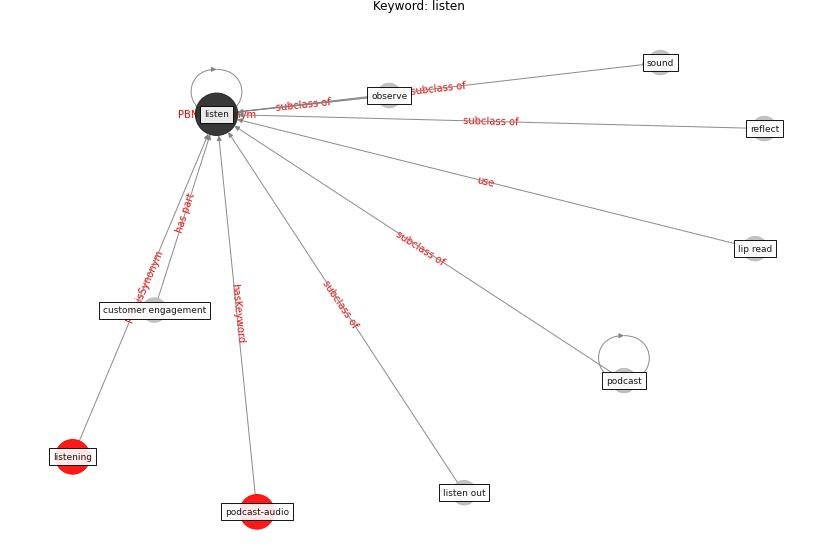

# Keyword: listen

* [podcast-audio](cluster_Cluster_7)

## Keywords

 * Cluster_7, customer engagement, lip read, [listen](keyword_listen), listen out, listening, observe, [podcast](keyword_podcast), reflect, [sound](keyword_sound)

## Concepts

 

## Neighbours

### Closest articles

* The City Under COVID‐19: Podcasting As Digital Methodology - [LINK](article_rogers_city_2020)
* The ventilation of buildings and other mitigating measures for COVID-19: a focus on wintertime - [LINK](article_burridge_ventilation_2021)
* How COVID-19 Could Accelerate the Adoption of New Retail Technologies and Enhance the (E-)Servicescape - [LINK](article_willems_how_2021)

### Closest BPs

