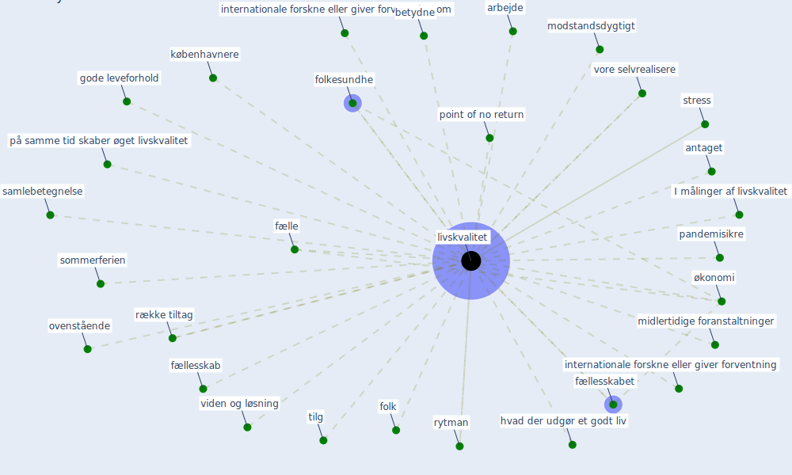

# Keyword: livskvalitet

## Keywords

 * I målinger af livskvalitet, antaget, arbejde, bedre, betydne, brugerne, byggede miljø, [covid-19](keyword_covid-19), folk, folkesundhe, forventning, fælle, fællesskab, fællesskabet, fællesskabet I foreningerne og det betydne, gode leveforhold, hvad der udgør et godt liv, internationale forskne eller giver forventning, internationale forskne eller giver forventning om, københavnere, [livskvalitet](keyword_livskvalitet), midlertidige foranstaltninger, modstandsdygtigt, ovenstående, pandemisikre, point of no return, på samme tid skaber øget livskvalitet, rytman, række tiltag, samlebetegnelse, sommerferien, [stress](keyword_stress), tilg, viden og løsning, vore selvrealisere, økonomi, økonomisk

## Mapping

## Neighbours

### Closest articles

* Refleksioner fra en pandemi - [LINK](article_realdania_refleksioner_2022)
* Pandemiens arkitektur - [LINK](article_realdania_pandemiens_2022)

### Closest BPs

